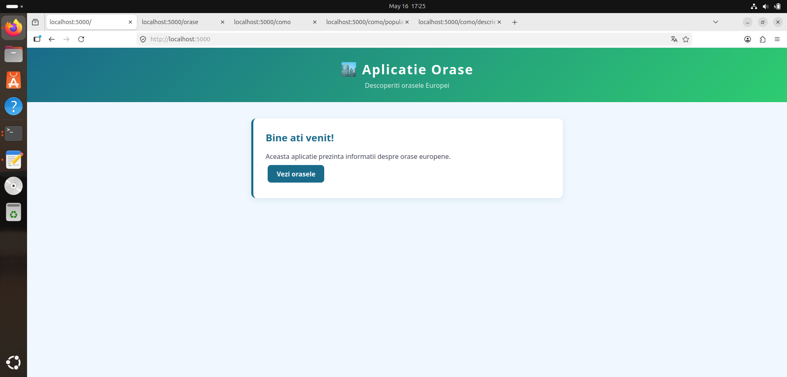
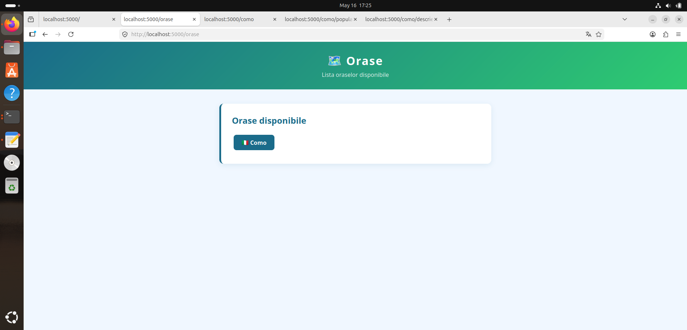
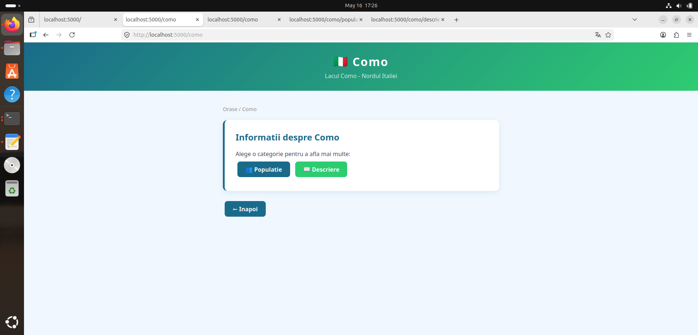
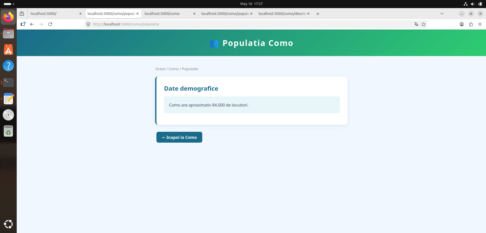
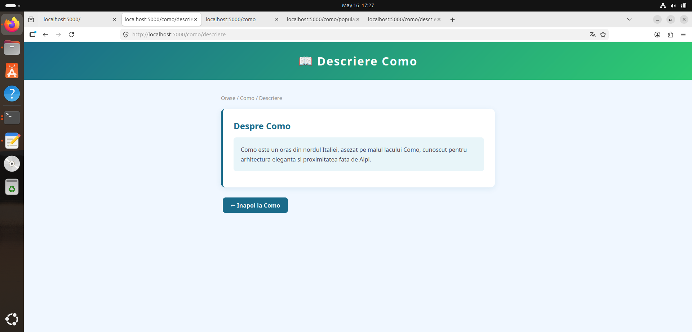
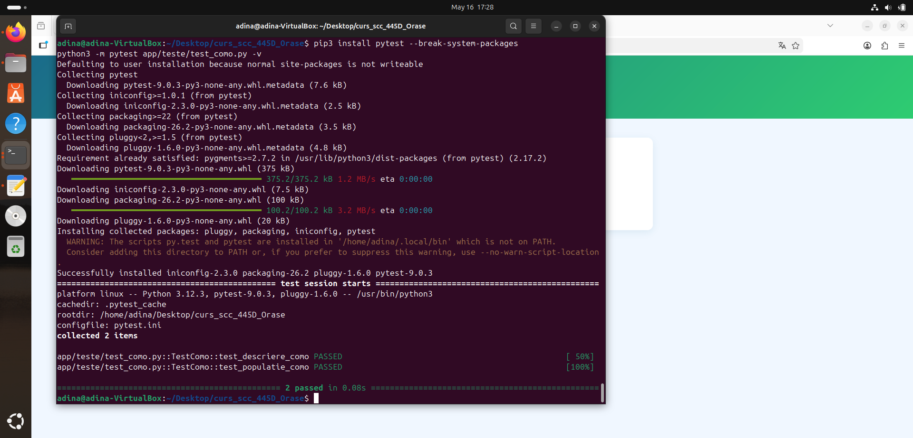
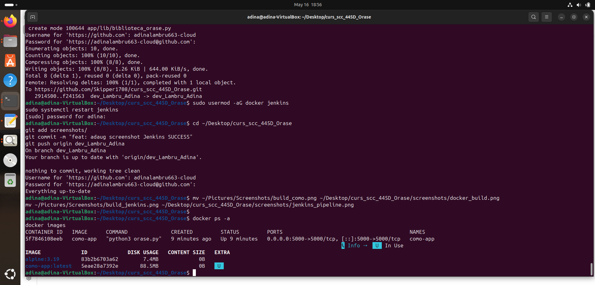
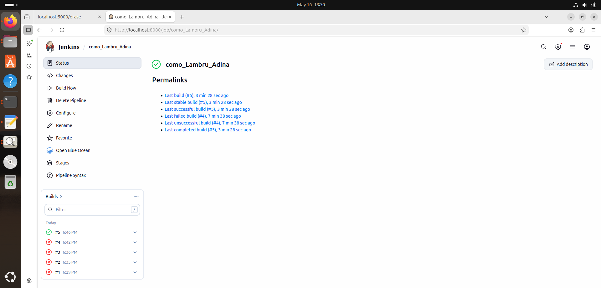
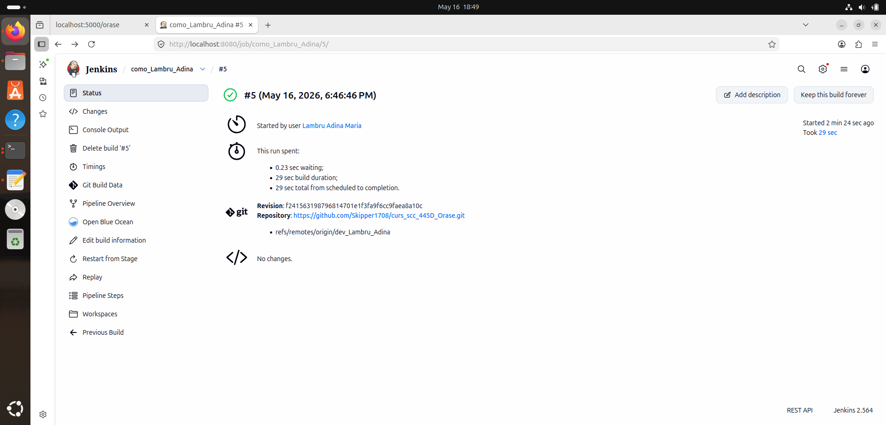

# Proiect SCC - Orașe - Como

## Lambru Adina - grupa 445D

## Cuprins
1. [Scopul proiectului](#scopul-proiectului)
2. [Date generale](#date-generale)
3. [Structura proiectului](#structura-proiectului)
4. [Functionalitatea implementata](#functionalitatea-implementata)
5. [Descrierea fisierelor](#descrierea-fisierelor)
6. [Descrierea functiilor implementate](#descrierea-functiilor-implementate)
7. [Descrierea rutelor implementate](#descrierea-rutelor-implementate)
8. [Testare locala](#testare-locala)
9. [Rezultatele testarii](#rezultatele-testarii)
10. [Integrare Git si GitHub](#integrare-git-si-github)
11. [Jenkins](#jenkins)
12. [Containerizare Docker](#containerizare-docker)
13. [Pull Request-uri si review](#pull-request-uri-si-review)

---

## Scopul proiectului
Proiect realizat in cadrul cursului Servicii Cloud si Containerizare (SCC).
Scopul este familiarizarea cu unelte folosite in industria software: Git/GitHub, Jenkins, Docker, masina virtuala.

## Date generale
- **Student:** Lambru Adina
- **Grupa:** 445D
- **Oras:** Como, Italia
- **Repository:** curs_scc_445D_Orase

## Structura proiectului
````
curs_scc_445D_Orase/
├── app/
│   ├── init.py
│   ├── lib/
│   │   └── biblioteca_orase.py
│   └── teste/
│       ├── init.py
│       └── test_como.py
├── screenshots/
├── Dockerfile
├── Jenkinsfile
├── orase.py
├── pytest.ini
├── quickrequirements.txt
└── README.md
````
## Functionalitatea implementata
Functionalitate pentru orasul **Como** (Italia):
- `populatie_como()` - returneaza populatia orasului Como
- `descriere_como()` - returneaza o descriere a orasului Como

## Descrierea fisierelor
- `orase.py` - fisierul principal Flask cu toate rutele aplicatiei
- `app/lib/biblioteca_orase.py` - biblioteca cu functiile specifice orasului Como
- `app/teste/test_como.py` - unit tests pentru functiile implementate
- `Dockerfile` - configuratie pentru containerizarea aplicatiei (FROM alpine)
- `Jenkinsfile` - pipeline CI/CD cu stagiile Build, Test, Deploy
- `pytest.ini` - configuratie pytest
- `quickrequirements.txt` - dependintele aplicatiei

## Descrierea functiilor implementate

### `populatie_como()`
Returneaza un string cu populatia orasului Como (~84.000 locuitori).

### `descriere_como()`
Returneaza un string cu o descriere a orasului Como, Italia.

## Descrierea rutelor implementate
| Ruta | Functie | Descriere |
|------|---------|-----------|
| `/` | `index()` | Pagina principala a aplicatiei |
| `/orase` | `orase()` | Lista oraselor disponibile |
| `/como` | `como()` | Pagina principala Como |
| `/como/populatie` | `como_populatie()` | Afiseaza populatia |
| `/como/descriere` | `como_descriere()` | Afiseaza descrierea |

## Testare locala

### Pornire aplicatie
```bash
python3 orase.py
```






### Rulare teste
```bash
python3 -m pytest app/teste/test_como.py -v
```

## Rezultatele testarii
Toate testele trec cu succes (PASSED).



## Integrare Git si GitHub
- Branch dezvoltare: `dev_Lambru_Adina`
- Branch integrare: `main_Lambru_Adina`
- PR creat din `dev_Lambru_Adina` spre `main_Lambru_Adina` cu review aprobat
- Branch `main` protejat - necesita PR si review

## Jenkins
Pipeline cu 3 stagii:
- **Build** - instalare dependinte
- **Test** - rulare unit tests cu pytest
- **Deploy** - creare si pornire container Docker





## Containerizare Docker
```bash
docker build -t como-app .
docker run -p 5000:5000 como-app
```


## Pull Request-uri si review
| PR | Branch sursa | Branch destinatie | Reviewer | Status |
|----|-------------|-------------------|----------|--------|
| #1 | dev_Lambru_Adina | main_Lambru_Adina | coleg | Aprobat |
