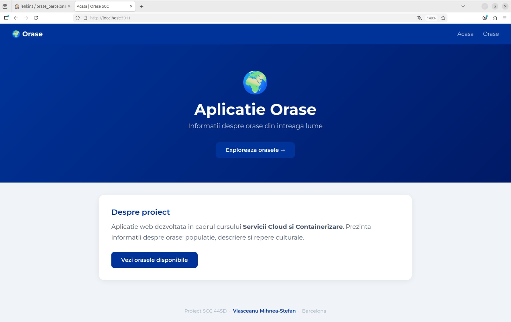
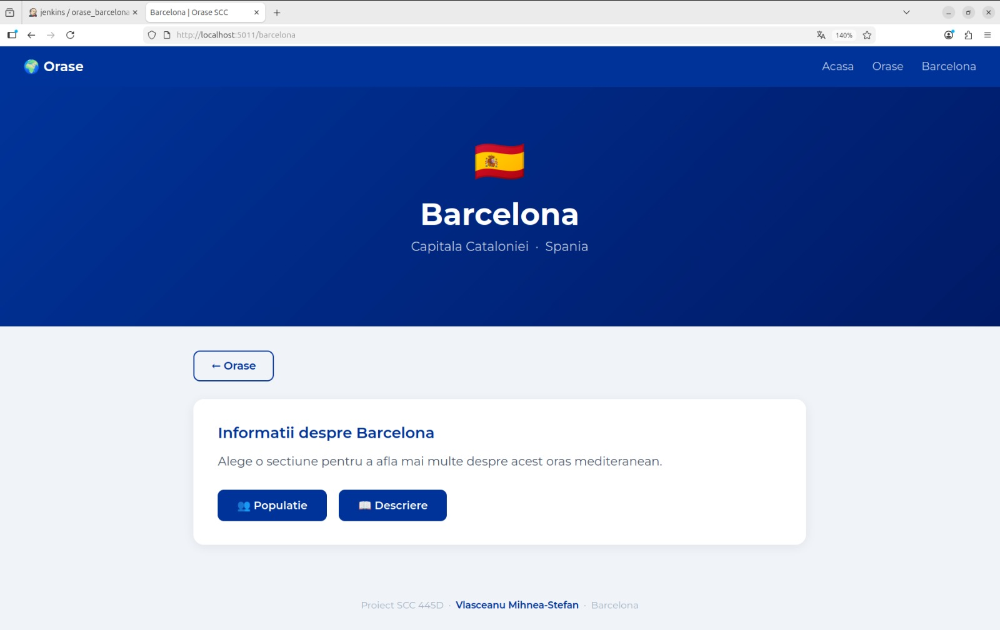
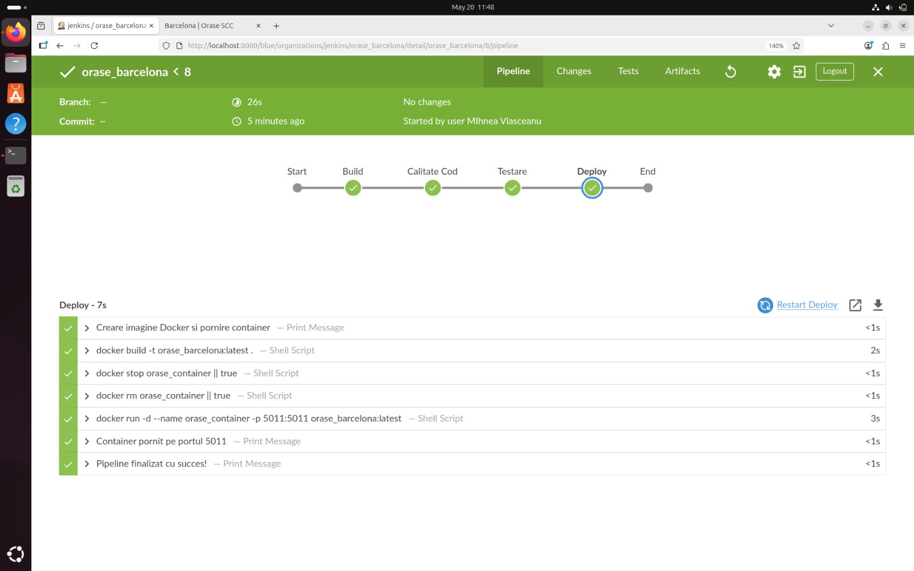
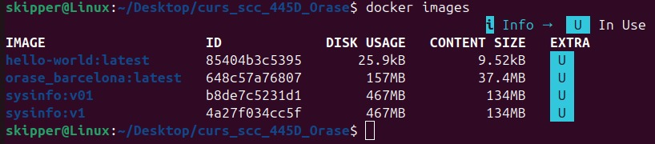
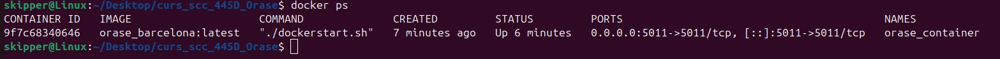
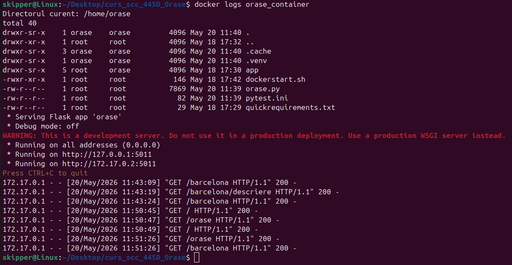

# Proiect SCC - Orașe - Barcelona

## Vlasceanu Mihnea-Stefan - grupa 445D

## Cuprins
1. [Scopul proiectului](#scopul-proiectului)
2. [Date generale](#date-generale)
3. [Structura proiectului](#structura-proiectului)
4. [Functionalitatea implementata](#functionalitatea-implementata)
5. [Descrierea fisierelor](#descrierea-fisierelor)
6. [Descrierea functiilor implementate](#descrierea-functiilor-implementate)
7. [Descrierea rutelor implementate](#descrierea-rutelor-implementate)
8. [Testare locala](#testare-locala)
9. [Rezultatele testarii](#rezultatele-testarii)
10. [Integrare Git si GitHub](#integrare-git-si-github)
11. [Jenkins](#jenkins)
12. [Containerizare Docker](#containerizare-docker)
13. [Pull Request-uri si review](#pull-request-uri-si-review)

---

## Scopul proiectului
Proiect realizat in cadrul cursului Servicii Cloud si Containerizare (SCC).
Scopul este familiarizarea cu unelte folosite in industria software: Git/GitHub, Jenkins, Docker, masina virtuala.

## Date generale
- **Student:** Vlasceanu Mihnea-Stefan
- **Grupa:** 445D
- **Oras:** Barcelona, Spania
- **Repository:** curs_scc_445D_Orase

## Structura proiectului
```
curs_scc_445D_Orase/
├── app/
│   ├── __init__.py
│   ├── lib/
│   │   ├── __init__.py
│   │   └── biblioteca_orase.py
│   └── tests/
│       ├── __init__.py
│       └── test_lib_orase.py
├── screenshots/
├── Dockerfile
├── Jenkinsfile
├── orase.py
├── pytest.ini
├── quickrequirements.txt
└── README.md
```

## Functionalitatea implementata
Functionalitate pentru orasul **Barcelona** (Spania):
- `populatie_barcelona()` - returneaza populatia orasului Barcelona
- `descriere_barcelona()` - returneaza o descriere a orasului Barcelona

## Descrierea fisierelor
- `orase.py` - fisierul principal Flask cu toate rutele aplicatiei
- `app/lib/biblioteca_orase.py` - biblioteca cu functiile specifice orasului Barcelona
- `app/tests/test_lib_orase.py` - unit tests pentru functiile implementate
- `Dockerfile` - configuratie pentru containerizarea aplicatiei (FROM python:3.10-alpine)
- `Jenkinsfile` - pipeline CI/CD cu stagiile Build, Calitate Cod, Testare, Deploy
- `pytest.ini` - configuratie pytest
- `quickrequirements.txt` - dependintele aplicatiei

## Descrierea functiilor implementate

### `populatie_barcelona()`
Returneaza un string cu populatia orasului Barcelona (~1.6 milioane de locuitori).

### `descriere_barcelona()`
Returneaza un string cu o descriere a orasului Barcelona, Spania.

## Descrierea rutelor implementate
| Ruta | Functie | Descriere |
|------|---------|-----------|
| `/` | `index()` | Pagina principala a aplicatiei |
| `/orase` | `orase()` | Lista oraselor disponibile |
| `/barcelona` | `barcelona()` | Pagina principala Barcelona |
| `/barcelona/populatie` | `populatie()` | Afiseaza populatia |
| `/barcelona/descriere` | `descriere()` | Afiseaza descrierea |

## Testare locala

### Pornire aplicatie
```bash
git clone https://github.com/Skipper1708/curs_scc_445D_Orase.git
cd curs_scc_445D_Orase
git checkout dev_Vlasceanu_Mihnea
python3 -m venv .venv && source .venv/bin/activate
pip install -r quickrequirements.txt
export FLASK_APP=orase
flask run --host=0.0.0.0 --port=5011
```




### Rulare teste
```bash
source .venv/bin/activate
pytest app/tests/test_lib_orase.py -v
```

## Rezultatele testarii
Toate testele trec cu succes (PASSED).



## Integrare Git si GitHub
- Branch dezvoltare: `dev_Vlasceanu_Mihnea`
- Branch integrare: `main_Vlasceanu_Mihnea`
- PR creat din `dev_Vlasceanu_Mihnea` spre `main_Vlasceanu_Mihnea` cu review aprobat
- Branch `main` protejat - necesita PR si review

## Jenkins
Pipeline cu 4 stagii:
- **Build** - creare mediu virtual Python si instalare dependinte
- **Calitate Cod** - analiza statica cu pylint
- **Testare** - rulare unit tests cu pytest
- **Deploy** - creare si pornire container Docker


## Containerizare Docker
```bash
docker build -t orase_barcelona:latest .
docker stop orase_container || true
docker rm orase_container || true
docker run -d --name orase_container -p 5011:5011 orase_barcelona:latest
```





## Pull Request-uri si review
| PR | Branch sursa | Branch destinatie | Reviewer | Status |
|----|-------------|-------------------|----------|--------|
| #1 | dev_Vlasceanu_Mihnea | main_Vlasceanu_Mihnea | coleg | Aprobat |
