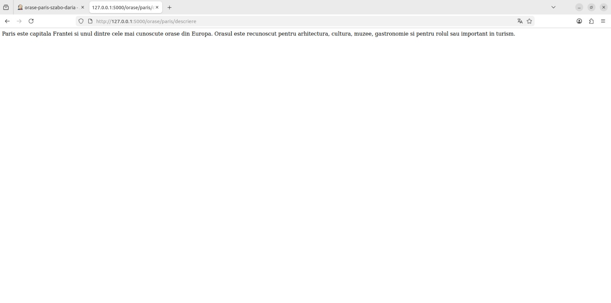
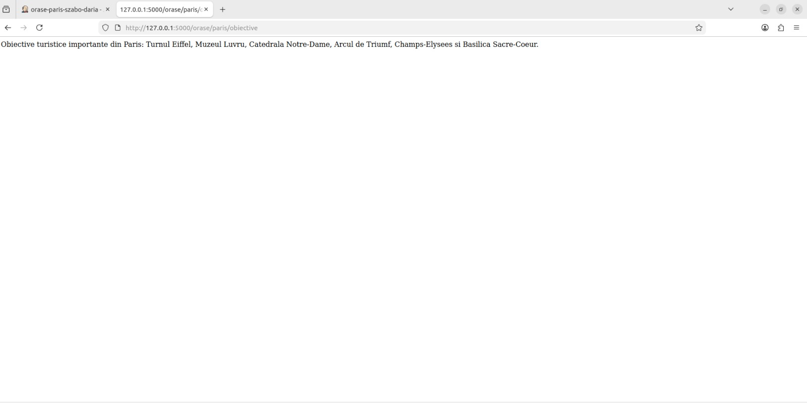
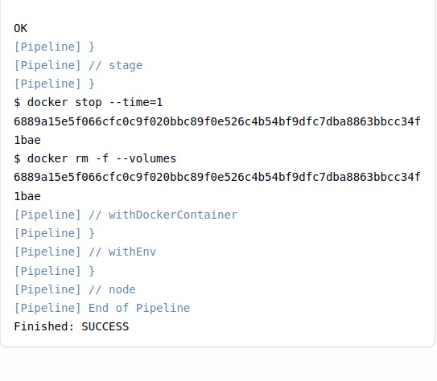
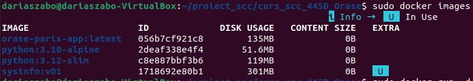
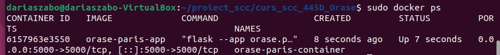
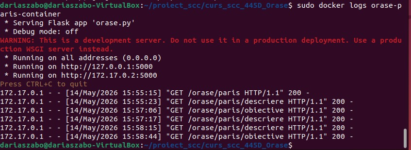

# Proiect SCC - Orase

## Dezvoltator
Szabo Daria Ioana

## Element ales
Paris

## Functionalitate adaugata
Am adaugat functionalitate pentru orasul Paris in cadrul temei Orase.

Fisiere adaugate/modificate:
- orase.py - aplicatia principala Flask
- app/lib/biblioteca_orase.py - functiile descriere_paris() si obiective_paris()
- app/routes/paris.py - Blueprint-ul si rutele pentru Paris
- app/test/test_biblioteca_orase.py - teste unitare pentru functiile din biblioteca
- requirement.txt - dependentele aplicatiei
- Dockerfile - containerizarea aplicatiei
- Jenkinsfile - pipeline declarativ pentru rularea testelor

## Rute adaugate
- / - pagina principala a aplicatiei
- /orase - pagina temei
- /orase/paris - pagina orasului Paris
- /orase/paris/descriere - afiseaza descrierea orasului Paris
- /orase/paris/obiective - afiseaza obiective turistice importante din Paris

## Stadiul implementarii
- [x] Cod adaugat
- [x] Rute Flask adaugate
- [x] Teste unitare adaugate
- [x] Dockerfile creat
- [x] Jenkinsfile creat
- [x] Testare manuala realizata
- [x] Testare Docker realizata
- [x] Testare Jenkins realizata

## Testare manuala
Aplicatia a fost pornita local folosind comanda:
python3 -m flask --app orase.py run --host=0.0.0.0

Au fost accesate urmatoarele rute in browser:
- http://127.0.0.1:5000/
- http://127.0.0.1:5000/orase
- http://127.0.0.1:5000/orase/paris
- http://127.0.0.1:5000/orase/paris/descriere
- http://127.0.0.1:5000/orase/paris/obiective

Rezultat: toate rutele au functionat corect si au returnat raspuns HTTP 200.

Screenshot-uri testare manuala:

Descriere Paris:

Obiective Paris:

## Teste unitare
Testele au fost rulate local cu:
PYTHONPATH=. python3 -m unittest discover -s app/test

Rezultat:
Ran 2 tests in 0.000s
OK

## Testare cu Jenkins
A fost creat un job Jenkins de tip Pipeline:
orase-paris-szabo-daria

Configurare Jenkins:
- Repository: https://github.com/Skipper1708/curs_scc_445D_Orase.git
- Branch: dev_Szabo_Daria
- Script Path: Jenkinsfile

Pipeline-ul are doua etape:
- Install dependencies
- Run tests

Rezultat final Jenkins:
Ran 2 tests in 0.000s
OK
Finished: SUCCESS

Screenshot Jenkins:

## Containerizare Docker
Imaginea Docker a fost construita cu:
sudo docker build -t orase-paris-app .

Containerul a fost pornit cu:
sudo docker run -d -p 5000:5000 --name orase-paris-container orase-paris-app

Verificare imagine:
sudo docker images

Verificare container:
sudo docker ps

Verificare log-uri container:
sudo docker logs orase-paris-container

Rute verificate din container:
- http://127.0.0.1:5000/orase/paris/descriere
- http://127.0.0.1:5000/orase/paris/obiective

Screenshot-uri containerizare:

Docker images:

Docker ps:

Browser - descriere Paris:

Browser - obiective Paris:

Docker logs:

## Probleme intampinate si rezolvare
1. Jenkins nu recunostea agent dockerfile.
Rezolvare: a fost instalat plugin-ul Docker Pipeline.

2. Jenkins nu avea permisiune sa foloseasca Docker.
Rezolvare:
sudo usermod -aG docker jenkins
sudo systemctl restart jenkins

3. Jenkins nu gasea modulul app.lib.
Cauza: .gitignore ignora folderul lib.
Rezolvare:
git add -f app/lib/__init__.py app/lib/biblioteca_orase.py
git commit -m "Adauga biblioteca pentru orasul Paris"
git push

## Integrare
Branch de dezvoltare:
dev_Szabo_Daria

Branch principal personal:
main_Szabo_Daria

Pull Request:
- Source: dev_Szabo_Daria
- Destination: main_Szabo_Daria
- Status: urmeaza sa fie creat / in asteptare review

## Pull Request-uri la care am facut review
- PR #<id> - <descriere>

## Ce mai este de facut
- Creare Pull Request din dev_Szabo_Daria in main_Szabo_Daria
- Obtinere review de la un coleg
- Realizare review la PR-ul unui coleg
- Integrarea modificarilor dupa aprobare
