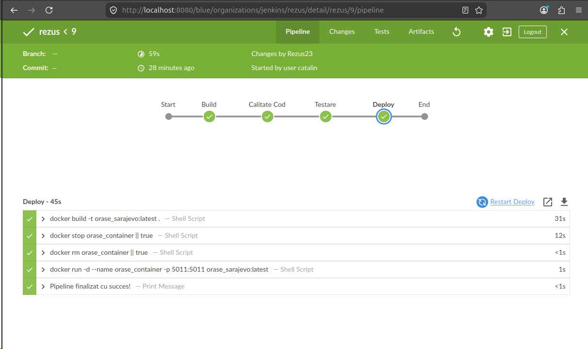
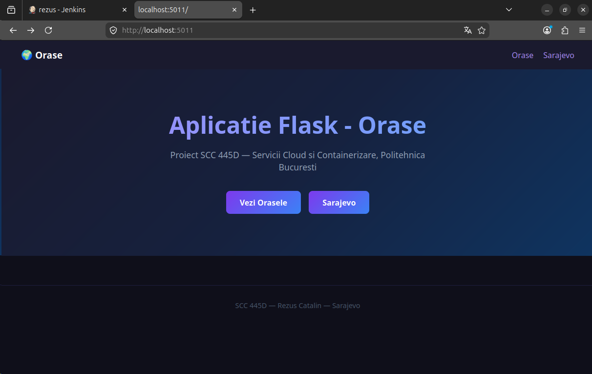

# Proiect SCC - Orașe - Sarajevo
## Rezus Catalin - grupa 445D

---

## Cuprins
1. [Scopul proiectului](#scopul-proiectului)
2. [Date generale](#date-generale)
3. [Cerințe acoperite în stadiul actual](#cerințe-acoperite-în-stadiul-actual)
4. [Structura proiectului](#structura-proiectului)
5. [Funcționalitatea implementată](#funcționalitatea-implementată)
6. [Descrierea fișierelor](#descrierea-fișierelor)
7. [Descrierea funcțiilor implementate](#descrierea-funcțiilor-implementate)
8. [Descrierea rutelor implementate](#descrierea-rutelor-implementate)
9. [Interfața aplicației](#interfața-aplicației)
10. [Testare locală](#testare-locală)
11. [Rezultatele testării](#rezultatele-testării)
12. [Integrare Git și GitHub](#integrare-git-și-github)
13. [Jenkins](#jenkins)
14. [Containerizare Docker](#containerizare-docker)
15. [Capturi de ecran necesare](#capturi-de-ecran-necesare)
16. [Pull Request-uri și review](#pull-request-uri-și-review)
17. [Stadiul actual al implementării](#stadiul-actual-al-implementării)
18. [Ce mai este de făcut](#ce-mai-este-de-făcut)
19. [Observații finale](#observații-finale)

---

## Scopul proiectului
Acest proiect a fost realizat în cadrul disciplinei **Servicii Cloud și Containerizare** și urmărește folosirea practică a unor tehnologii și unelte întâlnite frecvent în dezvoltarea software:
- mașină virtuală
- Git și GitHub
- Jenkins
- Docker
- aplicație web realizată cu Flask

În cadrul temei de grupă **Orașe**, am ales să implementez funcționalitatea pentru orașul **Sarajevo**.

Scopul implementării actuale a fost:
- realizarea unei aplicații Flask funcționale
- adăugarea unui element specific temei
- implementarea a două funcții specifice în bibliotecă
- crearea rutelor necesare
- realizarea testării locale
- containerizarea aplicației cu Docker
- rularea unui pipeline Jenkins complet

---

## Date generale
- **Nume student:** Rezus Catalin
- **Grupă:** 445D
- **Temă:** Orașe
- **Element ales:** Sarajevo
- **Repository de grupă:** `curs_scc_445D_Orase`
- **Branch personal de dezvoltare:** `dev_Rezus_Catalin`
- **Branch personal principal:** `main_Rezus_Catalin`
- **Fișier principal aplicație:** `orase.py`
- **Bibliotecă specifică temei:** `app/lib/biblioteca_orase.py`

---

## Cerințe acoperite în stadiul actual
În stadiul actual al proiectului au fost realizate următoarele:
- alegerea elementului specific temei: **Sarajevo**
- implementarea fișierului principal `orase.py`
- crearea bibliotecii `app/lib/biblioteca_orase.py`
- implementarea a două funcții specifice:
  - `populatie_sarajevo()`
  - `descriere_sarajevo()`
- implementarea rutelor cerute în aplicația principală
- adăugarea testelor automate cu pytest
- rularea pipeline-ului Jenkins cu succes
- containerizarea aplicației cu Docker

Nu sunt încă finalizate:
- obținerea unui review de la un coleg pentru PR-ul deschis
- integrarea README-ului în `main`

---

## Structura proiectului
```text
.
├── app
│   ├── __init__.py
│   ├── lib
│   │   ├── __init__.py
│   │   └── biblioteca_orase.py
│   └── tests
│       ├── __init__.py
│       └── test_lib_orase.py
├── orase.py
├── Dockerfile
├── Jenkinsfile
├── dockerstart.sh
├── activeaza_venv
├── activeaza_venv_jenkins
├── pytest.ini
├── quickrequirements.txt
└── README.md
```

---

## Funcționalitatea implementată
Am implementat o aplicație web Flask pentru tema **Orașe**, având ca element ales orașul **Sarajevo**.

Aplicația oferă:
- o pagină principală de prezentare
- o pagină pentru tema „Orașe"
- o pagină dedicată orașului Sarajevo
- o pagină pentru populația orașului Sarajevo
- o pagină pentru descrierea extinsă a orașului Sarajevo

Interfața a fost stilizată cu HTML și CSS direct în aplicație:
- dark theme elegant
- navbar cu navigare între pagini
- gradient pe titluri
- carduri cu borduri
- butoane cu efecte hover

Implementarea respectă ideea temei:
- există un fișier principal dedicat temei: `orase.py`
- există o bibliotecă dedicată: `app/lib/biblioteca_orase.py`
- există două funcții specifice elementului ales
- există rute pentru temă, element și informațiile specifice acestuia

---

## Descrierea fișierelor

### 1. `orase.py`
Este fișierul principal al aplicației web Flask.

Conține:
- inițializarea aplicației Flask
- stilizarea CSS globală inclusă direct în cod
- toate rutele implementate pentru tema și elementul ales
- apeluri către funcțiile din bibliotecă

### 2. `app/lib/biblioteca_orase.py`
Acest fișier conține funcțiile specifice elementului ales, adică orașului Sarajevo:
- `populatie_sarajevo()`
- `descriere_sarajevo()`

Aceste funcții returnează texte utilizate în paginile aplicației.

### 3. `app/tests/test_lib_orase.py`
Conține testele automate pentru funcțiile din bibliotecă, verificând că returnează string-uri nevide și că conțin numele orașului.

### 4. `Dockerfile`
Definește imaginea Docker bazată pe `python:3.10-alpine`, creează un utilizator dedicat, instalează dependențele și pornește aplicația Flask pe portul 5011.

### 5. `Jenkinsfile`
Definește pipeline-ul Jenkins cu 4 stage-uri: Build, Calitate Cod, Testare și Deploy.

### 6. `dockerstart.sh`
Script de pornire a aplicației Flask în interiorul containerului Docker.

### 7. `activeaza_venv` și `activeaza_venv_jenkins`
Scripturi pentru activarea mediului virtual Python local și în Jenkins.

### 8. `pytest.ini`
Asigură configurarea pentru rularea corectă a testelor cu `pytest`.

### 9. `quickrequirements.txt`
Conține dependențele Python necesare: flask, pytest, pylint, gunicorn.

---

## Descrierea funcțiilor implementate

### `populatie_sarajevo()`
Această funcție returnează un text descriptiv despre populația orașului Sarajevo.

Textul precizează că Sarajevo are aproximativ 275.000 de locuitori și este principalul centru urban al Bosniei și Herțegovinei.

### `descriere_sarajevo()`
Această funcție returnează o descriere a orașului Sarajevo.

În text sunt prezentate elemente precum:
- faptul că este capitala Bosniei și Herțegovinei
- diversitatea sa culturală
- rolul său în declanșarea Primului Război Mondial
- Războiul din Bosnia

---

## Descrierea rutelor implementate

### Ruta `/`
Pagina principală a aplicației.

Conține:
- titlul aplicației cu gradient
- descrierea proiectului
- butoane de navigare către celelalte pagini

### Ruta `/orase`
Prezintă lista orașelor disponibile în aplicație cu link-uri către paginile lor.

### Ruta `/sarajevo`
Prezintă informații generale despre Sarajevo cu butoane către populatie și descriere.

### Ruta `/sarajevo/populatie`
Apelează `populatie_sarajevo()` și afișează rezultatul într-un card stilizat.

### Ruta `/sarajevo/descriere`
Apelează `descriere_sarajevo()` și afișează rezultatul într-un card stilizat.

---

## Interfața aplicației
Interfața a fost realizată în mod simplu, direct în Flask, prin HTML și CSS incluse în paginile returnate de aplicație.

Elemente de interfață folosite:
- dark theme cu fundal `#0f0f1a`
- navbar cu navigare între pagini
- gradient violet/albastru pe titluri
- carduri cu borduri subtile
- butoane cu efecte hover și shadow
- structură clară și ușor de urmărit

---

## Testare locală

### Activarea mediului virtual
```bash
source activeaza_venv
```

### Rularea testelor
```bash
pytest app/tests/ -v
```

### Rularea aplicației local
```bash
export FLASK_APP=orase
flask run --host=0.0.0.0 --port=5011
```

### Rutele verificate manual în browser
```text
http://localhost:5011/
http://localhost:5011/orase
http://localhost:5011/sarajevo
http://localhost:5011/sarajevo/populatie
http://localhost:5011/sarajevo/descriere
```

---

## Rezultatele testării

### Testare automată
Testele au fost rulate în Jenkins cu `pytest`.

Rezultat obținut:
```text
2 passed
```

### Testare manuală
Aplicația a fost pornită în container Docker și toate rutele implementate au răspuns corect.

Rutele verificate:
- `/`
- `/orase`
- `/sarajevo`
- `/sarajevo/populatie`
- `/sarajevo/descriere`

---

## Integrare Git și GitHub
În această etapă au fost parcurși următorii pași:
- clonarea repository-ului de grupă
- crearea branch-urilor personale `dev_Rezus_Catalin` și `main_Rezus_Catalin`
- lucrul pe branch-ul personal `dev_Rezus_Catalin`
- adăugarea fișierelor necesare în proiect
- realizarea de commit-uri locale
- push în branch-ul personal de dezvoltare

Structura branch-urilor:
```
main                    ← branch-ul principal al grupei
dev_Rezus_Catalin       ← dezvoltare personală (cod + teste + docker)
main_Rezus_Catalin      ← branch personal principal (a primit PR, în așteptarea review-ului)
```

**Workflow Git urmat:**
1. `git checkout dev_Rezus_Catalin`
2. modificări fișiere
3. `git add <fisier>`
4. `git commit -m "mesaj"`
5. `git push`
6. Pull Request din `dev_Rezus_Catalin` → `main_Rezus_Catalin`

---

## Jenkins
Jenkins a fost configurat pentru rularea automată a pipeline-ului definit în fișierul `Jenkinsfile`.

Pipeline-ul executat în Jenkins a conținut următoarele etape:

**Stage 1 - Build:**
- creare mediu virtual Python
- instalare dependențe din `quickrequirements.txt`

**Stage 2 - Calitate Cod:**
- rulare pylint pe `app/lib/*.py`
- rulare pylint pe `app/tests/*.py`
- rulare pylint pe `orase.py`

**Stage 3 - Testare:**
- rulare pytest pe `app/tests/`
- rezultat: `2 passed`

**Stage 4 - Deploy:**
- build imagine Docker `orase_sarajevo:latest`
- oprire container vechi
- pornire container nou pe portul 5011

### Capturi Jenkins

#### 1. Build reușit în Jenkins


#### 2. Console Output cu testele trecute


---

## Containerizare Docker
Containerizarea aplicației a fost realizată prin fișierul `Dockerfile`.

Au fost parcurși următorii pași:
- construirea imaginii Docker `orase_sarajevo:latest`
- pornirea containerului pe portul `5011`
- verificarea accesării aplicației din browser
- verificarea containerului prin `docker ps`
- verificarea logurilor prin `docker logs`

Comenzi folosite:
```bash
docker build -t orase_sarajevo:latest .
docker run -d --name orase_container -p 5011:5011 orase_sarajevo:latest
docker ps
docker logs orase_container
```

Rezultatul obținut:
- imaginea Docker a fost creată cu succes
- containerul a fost pornit cu succes
- aplicația a putut fi accesată în browser din container pe portul 5011

---

## Capturi de ecran necesare
Conform cerințelor proiectului, au fost realizate și adăugate în documentație capturile de ecran pentru:
1. imaginea Docker creată (`docker images`)
2. containerul pornit (`docker ps`)
3. browserul care accesează aplicația rulată în container
4. logurile containerului (`docker logs orase_container`)
5. build-ul reușit în Jenkins
6. Console Output din Jenkins cu rezultatul testelor

### 1. Imaginea Docker creată


Imaginea `orase_sarajevo:latest` a fost construită cu succes (157MB, ID: db3e40434c94).

### 2. Containerul pornit


Containerul `orase_container` rulează pe portul `5011`, status `Up`.

### 3. Browserul care accesează aplicația din container


### 4. Logurile containerului


Flask servește corect toate rutele implementate — toate returnează status `200`.

---

## Pull Request-uri și review

### Pull Request pentru integrarea în branch-ul personal principal
PR creat din `dev_Rezus_Catalin` către `main_Rezus_Catalin` — review primit de la un coleg.

### Pull Request pentru integrarea în `main`
Nu a fost încă realizat.

### Pull Request-uri la care am făcut review

| ID PR | Autor | Branch |
|-------|-------|--------|
| #10 | Ionescu Mircea | dev_Ionescu_Mircea |

---

## Stadiul actual al implementării

### Realizat
- [x] alegerea elementului specific: Sarajevo
- [x] creare fișier principal `orase.py`
- [x] creare `app/lib/biblioteca_orase.py`
- [x] implementare funcții specifice
- [x] implementare rute Flask
- [x] interfață cu HTML + CSS (dark theme)
- [x] pagină principală cu navigare
- [x] pagină dedicată orașului
- [x] pagină pentru populație
- [x] pagină pentru descriere
- [x] testare automată cu pytest
- [x] commit și push în branch-ul personal de dezvoltare
- [x] documentare pe branch-ul de dezvoltare
- [x] Jenkinsfile cu 4 stage-uri
- [x] rulare pipeline Jenkins
- [x] build Jenkins cu SUCCESS
- [x] Dockerfile
- [x] build imagine Docker
- [x] pornire container Docker
- [x] accesare aplicație din container
- [x] capturi de ecran Docker și Jenkins adăugate în README
- [x] Pull Request deschis din `dev_Rezus_Catalin` în `main_Rezus_Catalin`
- [x] review primit de la un coleg

### Nerealizat încă
- [ ] integrare README în `main`

---

## Ce mai este de făcut
Proiectul este finalizat. Toți pașii principali au fost realizați cu succes.

---

## Observații finale
Aplicația a fost realizată pornind de la modelul general recomandat pentru proiect și a fost adaptată pentru tema **Orașe** și pentru elementul ales, **Sarajevo**.

Implementarea actuală respectă ideile principale cerute:
- fișier principal al aplicației
- bibliotecă dedicată cu două funcții specifice
- rute clare pentru temă și element
- testare automată cu pytest
- pipeline Jenkins complet cu 4 stage-uri
- containerizare Docker funcțională
- lucru pe branch personal de dezvoltare
- documentare pe GitHub

---
