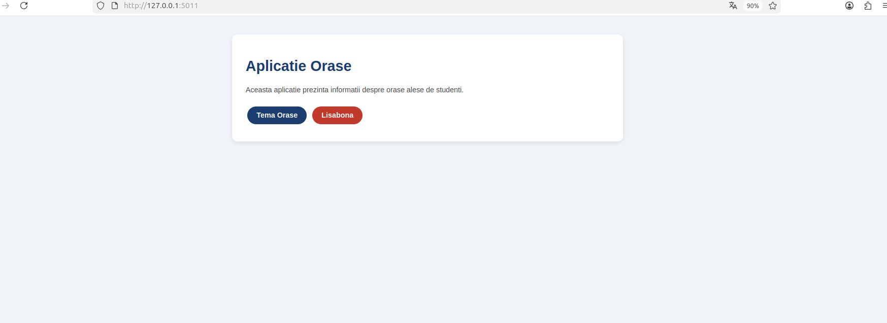
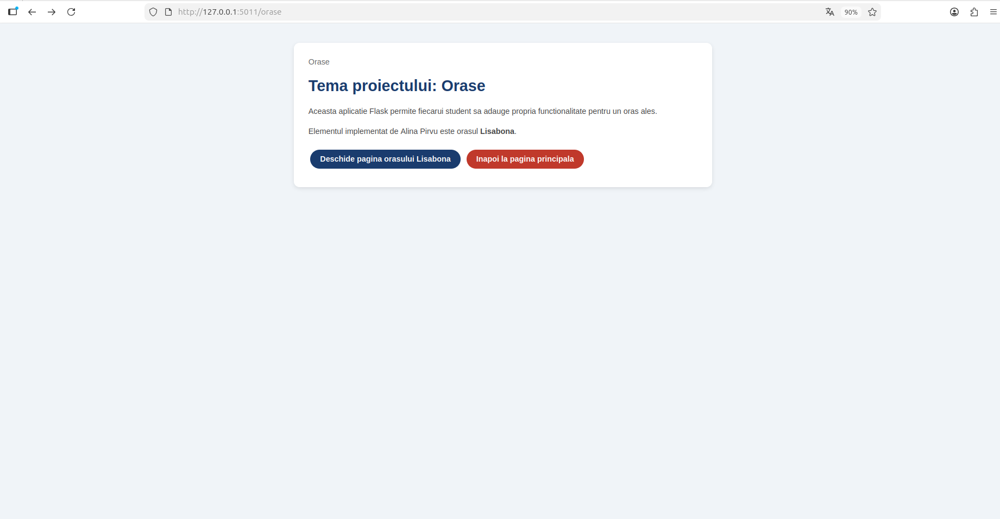
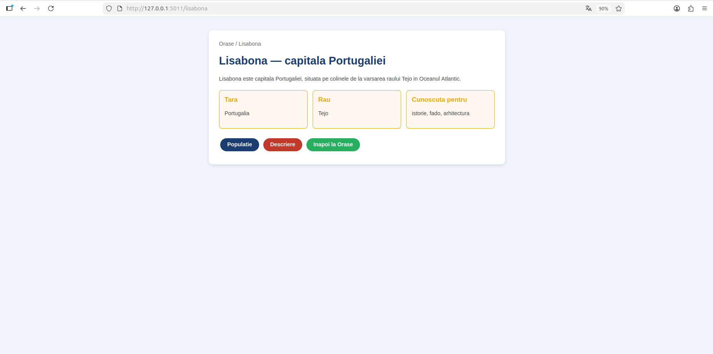
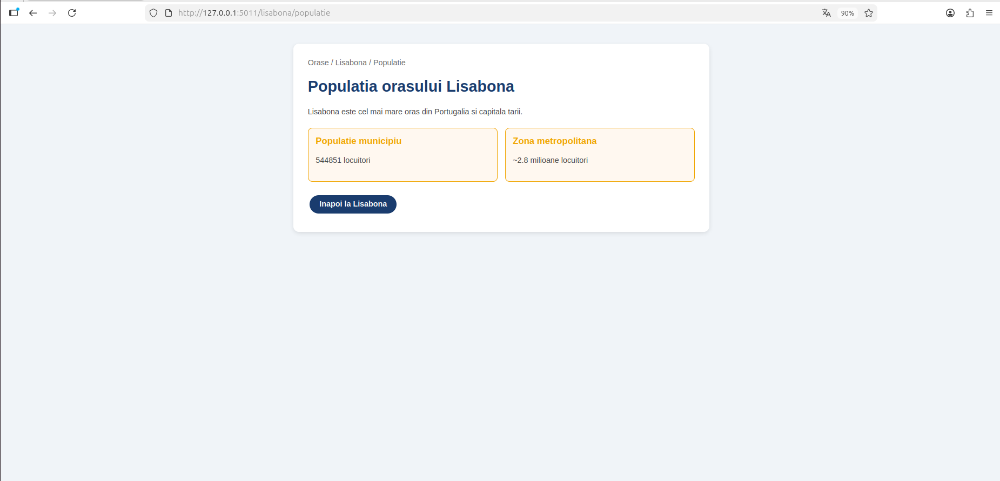
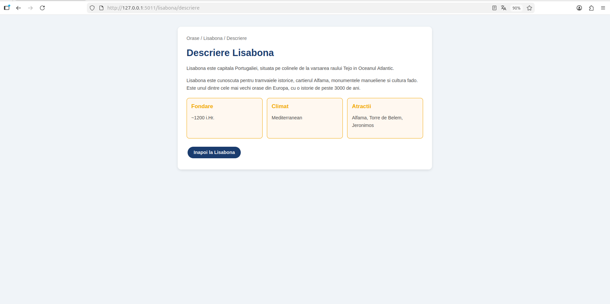
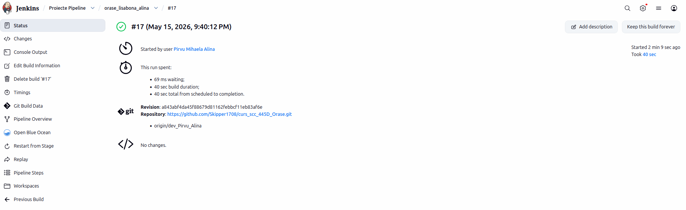
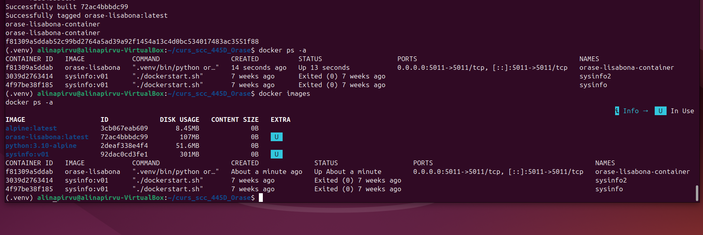

# Proiect SCC - Orașe - Lisabona
## Alina Pirvu - grupa 445D

## Cuprins
1. [Scopul proiectului](#scopul-proiectului)
2. [Date generale](#date-generale)
3. [Structura proiectului](#structura-proiectului)
4. [Functionalitatea implementata](#functionalitatea-implementata)
5. [Descrierea fisierelor](#descrierea-fisierelor)
6. [Descrierea functiilor implementate](#descrierea-functiilor-implementate)
7. [Descrierea rutelor implementate](#descrierea-rutelor-implementate)
8. [Testare locala](#testare-locala)
9. [Rezultatele testarii](#rezultatele-testarii)
10. [Integrare Git si GitHub](#integrare-git-si-github)
11. [Jenkins](#jenkins)
12. [Containerizare Docker](#containerizare-docker)
13. [Pull Request-uri si review](#pull-request-uri-si-review)

## Scopul proiectului
Acest proiect a fost realizat in cadrul disciplinei Servicii Cloud si Containerizare
si urmareste folosirea practica a unor tehnologii intalnite frecvent in dezvoltarea software:

- masina virtuala
- Git si GitHub
- Jenkins
- Docker
- aplicatie web realizata cu Flask

In cadrul temei de grupa Orase, am ales sa implementez functionalitatea pentru orasul Lisabona.

## Date generale
- **Nume student:** Alina Pirvu
- **Grupa:** 445D
- **Tema:** Orase
- **Element ales:** Lisabona
- **Repository de grupa:** curs_scc_445D_Orase
- **Branch personal de dezvoltare:** dev_Pirvu_Alina
- **Branch personal principal:** main_Pirvu_Alina
- **Fisier principal aplicatie:** orase.py
- **Biblioteca specifica temei:** app/lib/biblioteca_orase.py

## Structura proiectului

```text
curs_scc_445D_Orase/
│
├── app/
│   ├── lib/
│   │   └── biblioteca_orase.py
│   │
│   └── teste/
│       └── test_lisabona.py
│
├── screenshots/
├── Dockerfile
├── Jenkinsfile
├── pytest.ini
├── quickrequirements.txt
├── orase.py
└── README.md

## Screenshots

### Aplicatia principala


### Pagina Orase


### Pagina Lisabona


### Populatia Lisabonei


### Descriere Lisabona


### Jenkins Pipeline


### Docker


## Functionalitatea implementata
Am implementat o aplicatie web Flask pentru tema Orase, avand ca element ales orasul Lisabona.

Aplicatia ofera:
- o pagina principala de prezentare
- o pagina pentru tema Orase
- o pagina dedicata orasului Lisabona
- o pagina pentru populatia orasului Lisabona
- o pagina pentru descrierea orasului Lisabona

## Descrierea fisierelor

### 1. orase.py
Fisierul principal al aplicatiei web Flask. Contine:
- initializarea aplicatiei Flask
- toate rutele implementate pentru tema si elementul ales
- rularea locala a serverului pe portul 5011

### 2. app/lib/biblioteca_orase.py
Contine functiile specifice elementului ales, orasul Lisabona:
- get_populatie_lisabona()
- get_descriere_lisabona()

### 3. app/teste/test_lisabona.py
Contine testele automate pentru functiile din biblioteca.

### 4. Dockerfile
Defineste imaginea Docker pentru containerizarea aplicatiei, folosind FROM alpine.

### 5. Jenkinsfile
Defineste pipeline-ul Jenkins cu etapele: Build, Testare, Deploy.

### 6. pytest.ini
Configureaza rularea corecta a testelor cu pytest.

## Descrierea functiilor implementate

### get_populatie_lisabona()
Returneaza populatia orasului Lisabona (544.851 locuitori).
Afiseaza valoarea si o returneaza ca intreg.

### get_descriere_lisabona()
Returneaza o descriere a orasului Lisabona:
capitala Portugaliei, situata pe colinele de la varsarea raului Tejo in Oceanul Atlantic.

## Descrierea rutelor implementate

### Ruta /
Pagina principala a aplicatiei cu link catre Lisabona.

### Ruta /orase
Prezinta tema proiectului si elementul ales.

### Ruta /lisabona
Prezinta informatii generale despre Lisabona cu link-uri catre pagini specifice.

### Ruta /lisabona/populatie
Afiseaza populatia orasului Lisabona.

### Ruta /lisabona/descriere
Afiseaza descrierea extinsa a orasului Lisabona.

## Testare locala

### Activarea mediului virtual
```bash
source .venv/bin/activate
```

### Rularea testelor
```bash
pytest
```

### Rularea aplicatiei
```bash
python3 orase.py
```

### Rutele verificate manual in browser
- http://127.0.0.1:5011/
- http://127.0.0.1:5011/orase
- http://127.0.0.1:5011/lisabona
- http://127.0.0.1:5011/lisabona/populatie
- http://127.0.0.1:5011/lisabona/descriere

## Rezultatele testarii

### Testare automata
Testele au fost rulate local cu pytest.
Rezultat: **4 passed**

### Testare manuala
Aplicatia a fost pornita local si toate rutele au raspuns corect.

## Integrare Git si GitHub
Pasi parcursi:
- clonarea repository-ului de grupa
- crearea mediului local de lucru in masina virtuala
- lucrul pe branch-ul personal dev_Pirvu_Alina
- adaugarea fisierelor necesare in proiect
- commit si push in branch-ul personal de dezvoltare
- creare Pull Request din dev_Pirvu_Alina catre main_Pirvu_Alina
- obtinerea review-ului de la Skipper1708
- merge Pull Request

## Jenkins
Pipeline-ul Jenkins contine urmatoarele etape:

1. **Build** - instalare dependente
2. **Testare** - pylint si pytest
3. **Deploy** - build imagine Docker si pornire container

## Containerizare Docker
Aplicatia a fost containerizata folosind Docker.
Pasii parcursi:
- construirea imaginii Docker cu FROM alpine
- pornirea containerului pe portul 5011
- verificarea accesarii aplicatiei din browser

### Comenzi folosite
```bash
docker build -t orase-lisabona .
docker run -d --name orase-lisabona-container -p 5011:5011 orase-lisabona
docker ps -a
docker logs orase-lisabona-container
```

## Pull Request-uri si review
- **PR creat:** din dev_Pirvu_Alina catre main_Pirvu_Alina
- **Review primit de la:** Skipper1708 (aprobat)
- **Status:** Merged
