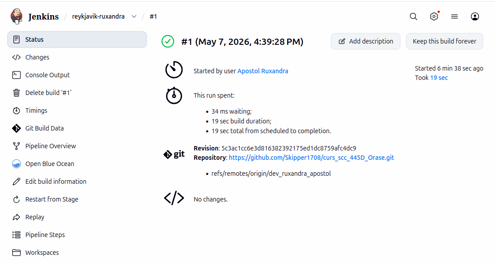
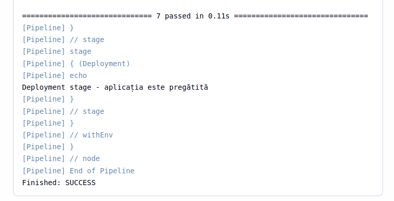
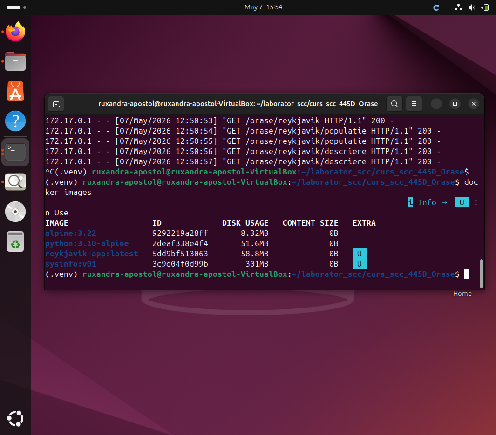
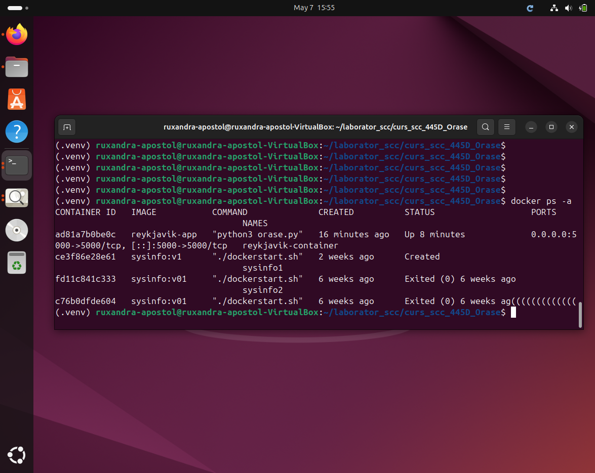
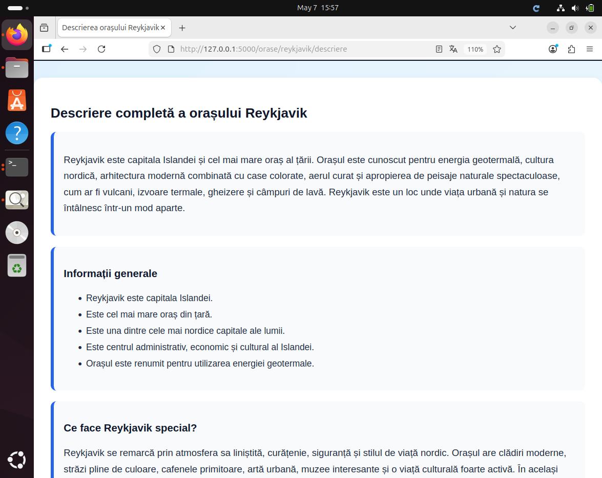
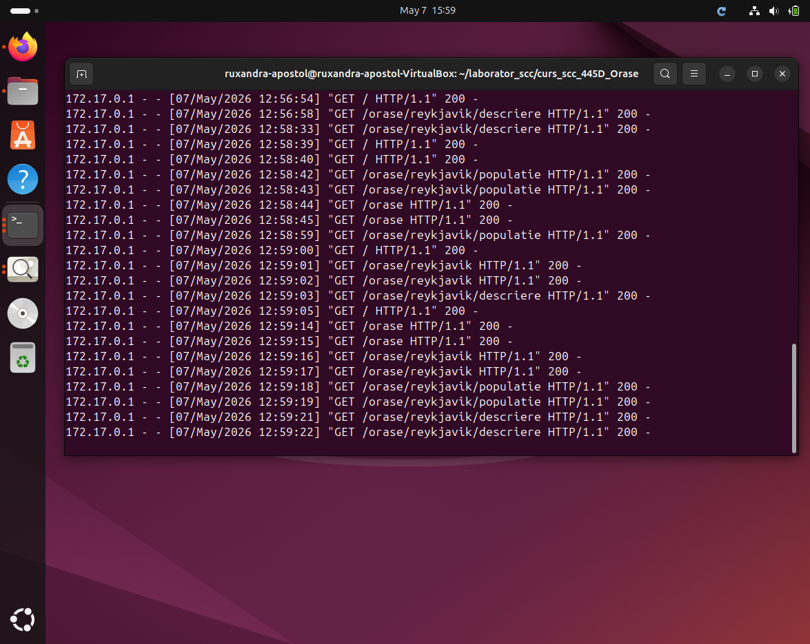

# Proiect SCC - Orașe - Reykjavik
## Ruxandra Apostol - grupa 445D

---

## Cuprins
1. [Scopul proiectului](#scopul-proiectului)
2. [Date generale](#date-generale)
3. [Cerințe acoperite în stadiul actual](#cerințe-acoperite-în-stadiul-actual)
4. [Structura proiectului](#structura-proiectului)
5. [Funcționalitatea implementată](#funcționalitatea-implementată)
6. [Descrierea fișierelor](#descrierea-fișierelor)
7. [Descrierea funcțiilor implementate](#descrierea-funcțiilor-implementate)
8. [Descrierea rutelor implementate](#descrierea-rutelor-implementate)
9. [Interfața aplicației](#interfața-aplicației)
10. [Testare locală](#testare-locală)
11. [Rezultatele testării](#rezultatele-testării)
12. [Integrare Git și GitHub](#integrare-git-și-github)
13. [Jenkins](#jenkins)
14. [Containerizare Docker](#containerizare-docker)
15. [Capturi de ecran necesare](#capturi-de-ecran-necesare)
16. [Pull Request-uri și review](#pull-request-uri-și-review)
17. [Stadiul actual al implementării](#stadiul-actual-al-implementării)
18. [Ce mai este de făcut](#ce-mai-este-de-făcut)
19. [Observații finale](#observații-finale)

---

## Scopul proiectului
Acest proiect a fost realizat în cadrul disciplinei **Servicii Cloud și Containerizare** și urmărește folosirea practică a unor tehnologii și unelte întâlnite frecvent în dezvoltarea software:
- mașină virtuală
- Git și GitHub
- Jenkins
- Docker
- aplicație web realizată cu Flask

În cadrul temei de grupă **Orașe**, am ales să implementez funcționalitatea pentru orașul **Reykjavik**.

Scopul implementării actuale a fost:
- realizarea unei aplicații Flask funcționale
- adăugarea unui element specific temei
- implementarea a două funcții specifice în bibliotecă
- crearea rutelor necesare
- realizarea testării locale
- pregătirea proiectului pentru pașii următori: Jenkins, Docker, Pull Request și integrare

---

## Date generale
- **Nume student:** Ruxandra Apostol
- **Grupă:** 445D
- **Temă:** Orașe
- **Element ales:** Reykjavik
- **Repository de grupă:** `curs_scc_445D_Orase`
- **Branch personal de dezvoltare:** `dev_ruxandra_apostol`
- **Branch personal principal:** `main_ruxandra_apostol`
- **Fișier principal aplicație:** `orase.py`
- **Bibliotecă specifică temei:** `app/lib/biblioteca_orase.py`

---

## Cerințe acoperite în stadiul actual
În stadiul actual al proiectului au fost realizate următoarele:
- alegerea elementului specific temei: **Reykjavik**
- implementarea fișierului principal `orase.py`
- crearea bibliotecii `app/lib/biblioteca_orase.py`
- implementarea a două funcții specifice:
  - `populatie_reykjavik()`
  - `descriere_reykjavik()`
- implementarea rutelor cerute în aplicația principală
- adăugarea testelor automate
- rularea locală a testelor cu `pytest`
- rularea locală a aplicației web în browser
- commit și push în branch-ul personal de dezvoltare

Nu sunt încă finalizate:
- crearea Pull Request-ului spre `main_ruxandra_apostol`
- obținerea unui review de la un coleg
- integrarea README-ului în `main`

---

## Structura proiectului
```text
.
├── app
│   ├── __init__.py
│   ├── lib
│   │   ├── __init__.py
│   │   └── biblioteca_orase.py
│   └── tests
│       └── test_orase.py
├── orase.py
├── pytest.ini
├── README.md
├── LICENSE
└── .gitignore
```

---

## Funcționalitatea implementată
Am implementat o aplicație web Flask pentru tema **Orașe**, având ca element ales orașul **Reykjavik**.

Aplicația oferă:
- o pagină principală de prezentare
- o pagină pentru tema „Orașe”
- o pagină dedicată orașului Reykjavik
- o pagină pentru populația orașului Reykjavik
- o pagină pentru descrierea extinsă a orașului Reykjavik

Am încercat să fac paginile mai prietenoase vizual, cu:
- butoane de navigare
- stilizare HTML + CSS direct în aplicație
- structurare pe carduri de conținut
- informații mai bogate decât o simplă propoziție

Implementarea respectă ideea temei:
- există un fișier principal dedicat temei: `orase.py`
- există o bibliotecă dedicată: `app/lib/biblioteca_orase.py`
- există două funcții specifice elementului ales
- există rute pentru temă, element și informațiile specifice acestuia

---

## Descrierea fișierelor

### 1. `orase.py`
Este fișierul principal al aplicației web Flask.

Conține:
- inițializarea aplicației Flask
- funcția generală `pagina_html(...)` pentru generarea paginilor
- toate rutele implementate pentru tema și elementul ales
- stilizarea generală a paginilor
- rularea locală a serverului pe portul `5000`

### 2. `app/lib/biblioteca_orase.py`
Acest fișier conține funcțiile specifice elementului ales, adică orașului Reykjavik:
- `populatie_reykjavik()`
- `descriere_reykjavik()`

Aceste funcții returnează texte utilizate în paginile aplicației.

### 3. `app/tests/test_orase.py`
Conține testele automate pentru:
- funcțiile din bibliotecă
- rutele aplicației Flask

### 4. `pytest.ini`
Asigură configurarea pentru rularea corectă a testelor cu `pytest`.

### 5. `README.md`
Documentează stadiul curent al proiectului, funcționalitatea implementată, testarea, integrarea, containerizarea și pașii rămași.

---

## Descrierea funcțiilor implementate

### `populatie_reykjavik()`
Această funcție returnează un text descriptiv despre populația orașului Reykjavik.

Textul precizează faptul că Reykjavik este:
- cel mai mare oraș din Islanda
- unul dintre cele mai importante centre urbane ale țării
- un centru administrativ, economic și cultural important
- un punct de concentrare pentru o parte semnificativă din populația Islandei

### `descriere_reykjavik()`
Această funcție returnează o descriere mai amplă a orașului Reykjavik.

În text sunt prezentate elemente precum:
- faptul că este capitala Islandei
- cultura nordică
- energia geotermală
- arhitectura specifică
- apropierea de natură
- peisajele vulcanice și termale

---

## Descrierea rutelor implementate

### Ruta `/`
Pagina principală a aplicației.

Conține:
- introducere în aplicație
- explicație despre tema proiectului
- legături către celelalte pagini

### Ruta `/orase`
Prezintă tema proiectului și faptul că elementul ales este Reykjavik.

### Ruta `/orase/reykjavik`
Prezintă informații generale despre Reykjavik:
- capitala Islandei
- centru urban important
- atracții și particularități
- legături către paginile specifice

### Ruta `/orase/reykjavik/populatie`
Prezintă informații mai dezvoltate despre populația orașului Reykjavik și rolul său în Islanda.

### Ruta `/orase/reykjavik/descriere`
Prezintă o descriere extinsă a orașului Reykjavik, inclusiv:
- informații generale
- ce face orașul special
- atracții turistice
- lucruri interesante care pot fi făcute
- curiozități despre oraș

---

## Interfața aplicației
Interfața a fost realizată în mod simplu, direct în Flask, prin HTML și CSS incluse în paginile returnate de aplicație.

Elemente de interfață folosite:
- fundal plăcut vizual
- zonă de antet pentru titlu
- carduri pentru gruparea informațiilor
- butoane de navigare între pagini
- structură clară și ușor de urmărit

Am ales această abordare deoarece este suficientă pentru cerințele proiectului și permite evidențierea clară a funcționalității implementate.

---

## Testare locală

### Activarea mediului virtual
```bash
source .venv/bin/activate
```

### Rularea testelor
```bash
pytest
```

### Rularea aplicației
```bash
python orase.py
```

### Rutele verificate manual în browser
```text
http://127.0.0.1:5000/
http://127.0.0.1:5000/orase
http://127.0.0.1:5000/orase/reykjavik
http://127.0.0.1:5000/orase/reykjavik/populatie
http://127.0.0.1:5000/orase/reykjavik/descriere
```

---

## Rezultatele testării

### Testare automată
Testele au fost rulate local cu `pytest`.

Rezultat obținut:
```text
7 passed
```

### Testare manuală
Aplicația a fost pornită local și toate rutele implementate au răspuns corect cu status `200`.

Din consola Flask s-a observat accesarea cu succes a rutelor:
- `/`
- `/orase`
- `/orase/reykjavik`
- `/orase/reykjavik/populatie`
- `/orase/reykjavik/descriere`

Concluzie:
- funcțiile din bibliotecă sunt folosite corect
- rutele sunt funcționale
- aplicația rulează local fără erori în testarea realizată până acum

---

## Integrare Git și GitHub
În această etapă au fost parcurși următorii pași:
- clonarea repository-ului de grupă
- crearea mediului local de lucru în mașina virtuală
- lucrul pe branch-ul personal `dev_ruxandra_apostol`
- adăugarea fișierelor necesare în proiect
- realizarea de commit local
- push în branch-ul personal de dezvoltare

Până în acest moment:
- codul este prezent în `dev_ruxandra_apostol`
- testele locale trec
- documentația este în curs de completare pe branch-ul de dezvoltare

---

## Jenkins
Jenkins a fost configurat pentru rularea automată a pipeline-ului definit în fișierul `Jenkinsfile`.

Pipeline-ul executat în Jenkins a conținut următoarele etape:
- Build
- Install dependencies
- Test
- Deployment

Rezultate obținute în Jenkins:
- build finalizat cu `SUCCESS`
- testele automate au trecut cu `7 passed`

În Jenkins:
- repository-ul a fost preluat din GitHub
- branch-ul folosit a fost `dev_ruxandra_apostol`
- dependențele necesare au fost instalate automat
- testele au fost executate cu succes

### Capturi Jenkins

#### 1. Build reușit în Jenkins


#### 2. Console Output cu testele trecute


## Containerizare Docker
Containerizarea aplicației a fost realizată prin adăugarea fișierului `Dockerfile`.

Au fost parcurși următorii pași:
- construirea imaginii Docker pentru aplicație
- pornirea containerului pe portul `5000`
- verificarea accesării aplicației din browser
- verificarea containerului prin `docker ps -a`
- verificarea logurilor prin `docker logs`

Rezultatul obținut:
- imaginea Docker a fost creată cu succes
- containerul a fost pornit cu succes
- aplicația a putut fi accesată în browser din container

---

## Capturi de ecran necesare
Conform cerințelor proiectului, au fost realizate și adăugate în documentație capturile de ecran pentru:
1. imaginea Docker creată
2. containerul creat pe baza imaginii
3. browserul care accesează aplicația rulată în container
4. mesajele afișate în consola containerului
5. build-ul reușit în Jenkins
6. `Console Output` din Jenkins, unde se vede rezultatul testelor

---

## Pull Request-uri și review

### Pull Request pentru integrarea în branch-ul personal principal
Nu a fost încă realizat.

Va fi creat:
- din `dev_ruxandra_apostol`
- către `main_ruxandra_apostol`

### Pull Request pentru integrarea în `main`
Nu a fost încă realizat.

### Review primit de la coleg
Nu a fost încă obținut.

### Pull Request-uri la care am făcut review
Momentan nu există review-uri efectuate de mine, deci nu există încă ID-uri de trecut în această secțiune.

---

## Stadiul actual al implementării

### Realizat
- [x] alegerea elementului specific: Reykjavik
- [x] creare fișier principal `orase.py`
- [x] creare `app/lib/biblioteca_orase.py`
- [x] implementare funcții specifice
- [x] implementare rute
- [x] pagină principală cu navigare
- [x] pagină dedicată orașului
- [x] pagină pentru populație
- [x] pagină pentru descriere extinsă
- [x] testare automată locală
- [x] testare manuală locală
- [x] commit și push în branch-ul personal de dezvoltare
- [x] documentare pe branch-ul de dezvoltare
- [x] Jenkinsfile
- [x] rulare pipeline Jenkins
- [x] build Jenkins cu `SUCCESS`
- [x] teste trecute în Jenkins (`7 passed`)
- [x] Dockerfile
- [x] build imagine Docker
- [x] pornire container Docker
- [x] accesare aplicație din container
- [x] capturi de ecran pentru containerizare
- [x] capturi de ecran pentru Jenkins

### Nerealizat încă
- [ ] Pull Request din `dev_ruxandra_apostol` în `main_ruxandra_apostol`
- [ ] review de la un coleg
- [ ] integrare README în `main`

---

## Ce mai este de făcut
Pașii rămași pentru finalizarea completă a proiectului sunt:
1. crearea Pull Request-ului din `dev_ruxandra_apostol` în `main_ruxandra_apostol`
2. obținerea unui review de la cel puțin un coleg
3. integrarea README-ului în branch-ul `main`
4. actualizarea finală a documentației după PR și review

---

## Observații finale
Aplicația a fost realizată pornind de la modelul general recomandat pentru proiect și a fost adaptată pentru tema **Orașe** și pentru elementul ales, **Reykjavik**.

Implementarea actuală respectă ideile principale cerute:
- fișier principal al aplicației
- bibliotecă dedicată cu două funcții specifice
- rute clare pentru temă și element
- testare locală
- lucru pe branch personal de dezvoltare
- documentare pe GitHub

README-ul va fi actualizat în continuare după:
- realizarea Pull Request-ului
- obținerea review-ului
- integrarea în branch-urile necesare

---

## Capturi de ecran realizate

### 1. Imaginea Docker creată


### 2. Containerul creat pe baza imaginii


### 3. Browserul care accesează aplicația rulată în container


### 4. Mesajele afișate în consola containerului


---
