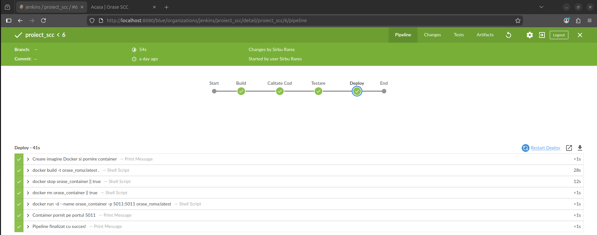
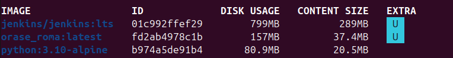
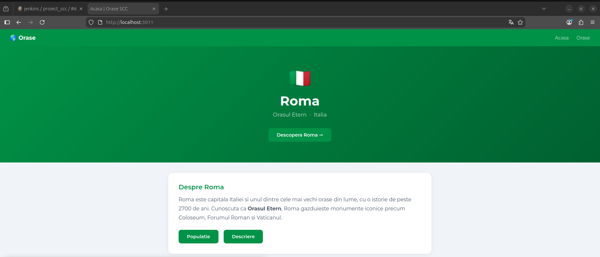
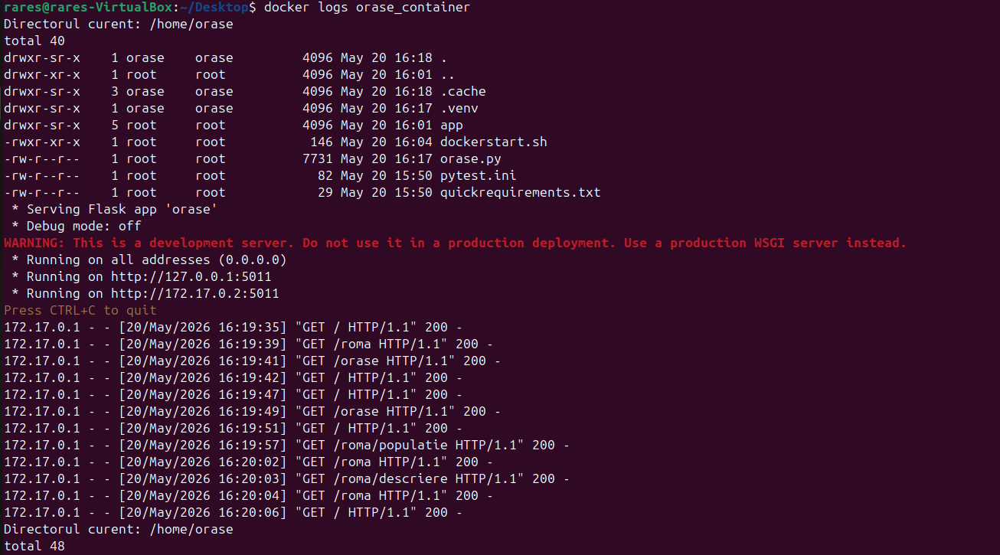

# Roma — Proiect SCC 445D

**Student:** Sirbu Rares  
**Grupa:** 445D  
**Oras:** Roma  

---

## 1. Functionalitatea adaugata

Aplicatie web Flask care prezinta informatii despre orasul **Roma**.

**Rute implementate:**

| Ruta | Descriere |
|------|-----------|
| `/` | Pagina principala |
| `/orase` | Lista oraselor disponibile |
| `/roma` | Pagina dedicata Romei |
| `/roma/populatie` | Populatia orasului Roma |
| `/roma/descriere` | Descrierea orasului Roma |

**Functii implementate in `app/lib/biblioteca_orase.py`:**
- `populatie_roma()` — returneaza populatia Romei ca string
- `descriere_roma()` — returneaza o descriere a Romei ca string

---

## 2. Stadiul implementarii

- [x] Aplicatie Flask cu 5 rute
- [x] Functii `populatie_roma()` si `descriere_roma()` in `biblioteca_orase.py`
- [x] Teste pytest in `app/tests/test_lib_orase.py`
- [x] Dockerfile functional
- [x] Jenkinsfile cu 4 stage-uri
- [x] Pipeline Jenkins trece (PASS)
- [x] Container Docker pornit si accesibil din browser
- [x] PR dev -> main_Sirbu_Rares

---

## 3. Testare

### Rulare locala

```bash
git checkout dev_Sirbu_Rares
. ./activeaza_venv
flask run --host=0.0.0.0 --port=5011
```

### Rulare teste pytest

```bash
. ./activeaza_venv
pytest app/tests/ -v
```

### Rulare cu Jenkins

1. Deschide `http://localhost:8080`
2. Intra in job-ul `proiect_scc`
3. Click **Build Now**
4. Toate cele 4 stage-uri trec cu succes

**Screenshot Jenkins PASS:**



---

## 4. Integrare Git

**Structura branch-uri:**

```
main                  — branch-ul principal al grupei
dev_Sirbu_Rares       — branch-ul de dezvoltare (cod + teste)
main_Sirbu_Rares      — branch-ul de productie personal
```

**Workflow:**

```
1. git checkout dev_Sirbu_Rares
2. [modificari cod]
3. git add <fisiere>
4. git commit -m "mesaj"
5. git push
6. git pull (pe VM)
7. Build Now in Jenkins
```

**Repository:** https://github.com/Skipper1708/curs_scc_445D_Orase

---

## 5. Containerizare Docker

### Comenzi utilizate

```bash
docker build -t orase_roma:latest .
docker run -d --name orase_container -p 5011:5011 orase_roma:latest
docker images
docker ps
docker logs orase_container
```

### Screenshots Docker

**docker images:**



**docker ps:**


**Aplicatie in browser:**



**docker logs:**



---

## 6. PR-uri la care am facut review

| PR | Autor |
|----|-------|
| — | — |

---

## 7. Ce mai este de facut

- Review la PR-ul unui coleg
- Adaugare README in `main` al grupei prin PR
