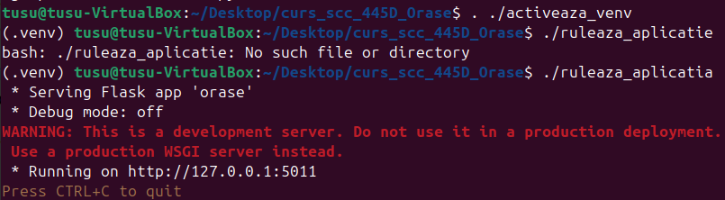
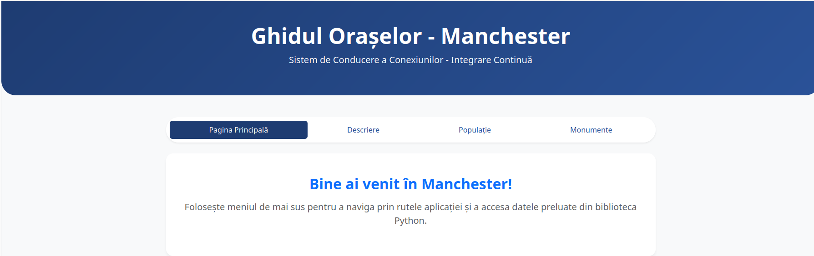
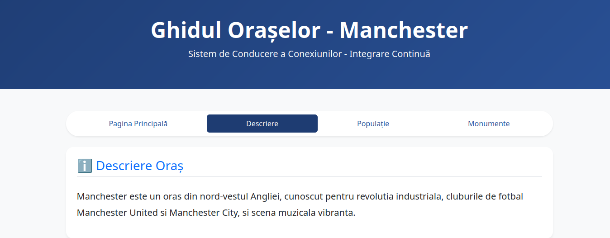
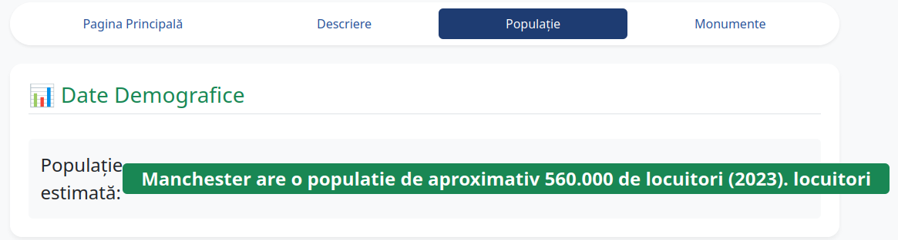
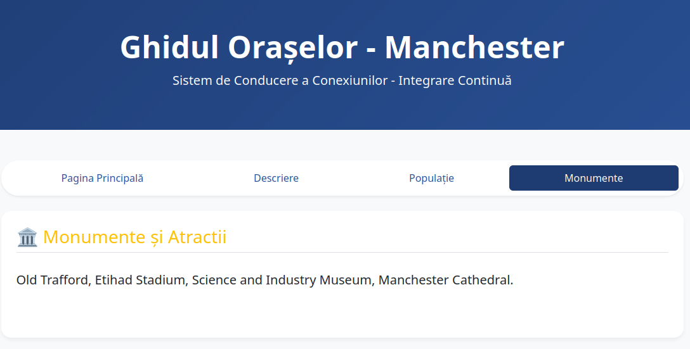
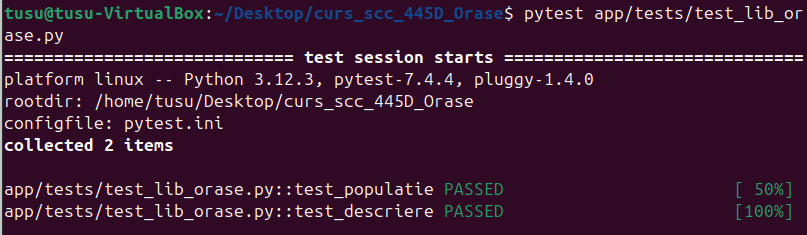
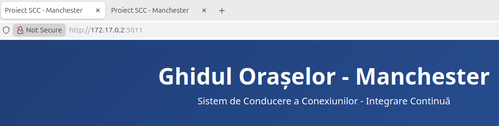

# Proiect SCC - Orașe - Manchester
===================================

# Cuprins

1. [Dezvoltator](#dezvoltator)
1. [Descriere aplicatie](#descriere-aplicatie)
1. [Descriere versiune](#descriere-versiune)
1. [Configurare](#configurare)
1. [Exemple pagina web](#exemple-pagina-web)
1. [Testare cu pytest](#testare-cu-pytest)
1. [Verificare statica cu pylint](#verificare-statica-cu-pylint)
1. [Docker](#docker)
1. [DevOps CI](#devops-ci)
   1. [Pipeline Jenkins](#exemplu-executie-pipeline-jenkins)
1. [Bibliografie](#bibliografie)

# Dezvoltator
[cuprins](#cuprins)
- **Nume:** Mitrea Tudor-Andrei
- **Grupă:** 445D
- **Oraș alocat:** Manchester

# Descriere aplicatie
[cuprins](#cuprins)

Elementul **Manchester** din aplicația orase gestionează și afișează informații detaliate despre geografia, demografia și cultura orașului Manchester într-o interfață web intuitivă și modernă.
Sistemul de operare țintă este Linux, aplicația fiind dezvoltată și testata pe distribuția `Ubuntu`.
Componenta WEB a proiectului utilizează framework-ul `Flask` combinat cu un șablon stilizat în `Bootstrap v5`.

Arhitectura este una modulară: datele sunt procesate și extrase prin funcții dedicate localizate în pachetul `app/lib/` (în `biblioteca_orase.py`), fiind ulterior preluate și returnate cu ajutorul funcțiilor view (localizate în `orase.py`) către client sub forma de pagini HTML dinamice prin `render_template`.

Pentru o experiență de utilizare facilă, interfața include un sistem de navigare integrat de tip navbar/pills:

* **Pagina principală:** Conține o urare de bun venit și instrucțiuni de navigare prin rutele aplicației.
* **Descriere:** Afișează o prezentare generală și contextul istoric/geografic al orașului Manchester.
* **Populație:** Prezintă datele demografice și numărul actualizat de locuitori, evidențiat prin elemente grafice.
* **Monumente:** Afișează atracțiile principale și obiectivele turistice reprezentative (Old Trafford, Etihad Stadium, Science and Industry Museum).

Aplicația include suport complet pentru containerizare prin fișierul `Dockerfile` localizat în directorul principal.

Din punct de vedere al verificării calității, aplicația include:
* **Unit testing:** Realizat cu `pytest` pentru funcțiile din `app/lib/`, testele fiind organizate în directorul `app/tests/`.
* **Analiza statică:** Verificarea conformității codului și stilului de programare utilizând `pylint`.

Pipeline-ul de automatizare pentru Jenkins este definit în fișierul `Jenkinsfile`. Acesta parcurge automat etapele de Build (creare venv), Calitate Cod (pylint), Testare (pytest) și Deploy (lansarea containerului Docker local pe portul 5011).

# Descriere versiune
[cuprins](#cuprins)

## v1.0 - Implementare structură ierarhică, interfață Bootstrap și integrare Docker/Jenkins.
* Afișare date structurate despre Manchester.
* Adăugare meniu dinamic de navigare direct în șablonul HTML.
* Configurare și mapare porturi pentru acces transparent din container.

### Rute aplicație WEB:
* **Pagina Principală** `/` - URL: `http://127.0.0.1:5011`
* **Descriere Oraș**:    `/descriere` - URL: `http://127.0.0.1:5011/descriere`
* **Date Demografice**:  `/populatie` - URL: `http://127.0.0.1:5011/populatie`
* **Monumente**:         `/monumente` - URL: `http://127.0.0.1:5011/monumente`

# Configurare
[cuprins](#cuprins)

Configurare `.venv` și instalare pachete.

În directorul rădăcină `curs_scc_445D_Orase` rulați comenzile:

1) **activeaza_venv**: Inițializează și activează mediul virtual. Dacă acesta nu există, configurează folderul `.venv` și instalează automat pachetele necesare din `quickrequirements.txt`.
                
2) **ruleaza_aplicatia**: Script local de pornire. Va lansa serverul Flask local pe portul `5011`.
                      Acces server din browser: `http://127.0.0.1:5011`

# Exemplu activare venv si rulare

    tusu@tusu-VirtualBox:~/Desktop/curs_scc_445D_Orase$ . ./activeaza_venv
    SUCCESS: venv was activated.
    (.venv) tusu@tusu-VirtualBox:~/Desktop/curs_scc_445D_Orase$ ./ruleaza_aplicatia 
    * Serving Flask app 'orase'
    * Debug mode: off
    * Running on http://0.0.0.0:5011
    Press CTRL+C to quit



# Exemple pagina web
[cuprins](#cuprins)

## Pagina principala


## Pagina - Descriere


## Pagina - Populatie


## Pagina - Monumente


# Testare cu pytest
[cuprins](#cuprins)

Funcțiile logice din biblioteca aplicației, localizate în folderul `app/lib/` (fișierul `biblioteca_orase.py`), au teste unitare asociate care validează răspunsurile corecte.

Execuția testelor se face din directorul rădăcină folosind comanda:

```bash
(.venv) tusu@tusu-VirtualBox:~/Desktop/curs_scc_445D_Orase$ pytest app/tests/ -v
```
Testele au fost rulate local cu succes folosind pytest:


# Verificare statica cu pylint
[cuprins](#cuprins)

Pentru verificarea calității codului sursă se utilizează pachetul **pylint**. Acesta analizează conformitatea codului cu standardele Python (verifică spații, convenții de numire a variabilelor, variabile neutilizate etc.).

În cadrul acestui proiect, problemele raportate de **pylint** sunt doar afișate pentru monitorizare, nu sunt considerate erori.

```bash
(.venv) tusu@tusu-VirtualBox:~/Desktop/curs_scc_445D_Orase$ pylint --exit-zero app/lib/biblioteca_orase.py
(.venv) tusu@tusu-VirtualBox:~/Desktop/curs_scc_445D_Orase$ pylint --exit-zero app/tests/test_lib_orase.py
(.venv) tusu@tusu-VirtualBox:~/Desktop/curs_scc_445D_Orase$ pylint --exit-zero orase.py
```

# Docker
[cuprins](#cuprins)

Aplicația a fost containerizată folosind o imagine de Python 3.10-alpine. Containerul este configurat să ruleze procesul Flask pe portul intern **5011**.
docker build -t orase_manchester:latest . este comanda pentru creare.


## Accesare aplicație din browser:
Aplicația poate fi accesată local la adresa http://localhost:8020 sau direct prin IP-ul intern alocat de Docker http://172.17.0.2:5011.


Pentru oprirea și eliminarea containerului, se utilizează următoarele comenzi:
 * **Oprire**: `docker stop test-manchester`
 * **Ștergere**: `docker rm test-manchester`

# DevOps CI
[cuprins](#cuprins)

Integrarea fluxului de livrare continuă este orchestrată automat prin intermediul unui script de configurare de tip Jenkinsfile, aflat direct în rădăcina depozitului de cod. Rolul central al acestui pipeline automatizat constă în asigurarea integrității codului sursă prin mecanisme riguroase de validare statică, urmate de rularea suitelor de teste unitare și funcționale. După validarea completă a etapelor de control al calității, infrastructura CI/CD rulează procedurile de deploy, generând o nouă imagine de container Docker stabilă și asigurând livrarea predictibilă și automată a aplicației în mediul de execuție, fără intervenție manuală.

## Exemplu executie pipeline Jenkins

Pentru a se putea executa cu succes ultimul pas din pipeline-ul de Jenkins (crearea și lansarea containerului Docker), este necesar ca utilizatorul `jenkins` să aibă permisiuni de rulare a comenzilor Docker fără `sudo`.

Puteti gasi pasii de configurare pe [docs.docker.com - linux-postinstall](https://docs.docker.com/engine/install/linux-postinstall/).
Daca folositi masina virtuala linux, restartati masina dupa ce faceti configuratia.

**Etapele Pipeline-ului:**
1. **Build**: Crearea mediului virtual și instalarea dependințelor.
2. **Linter**: Verificarea stilului codului cu `pylint`.
3. **Unit Tests**: Rularea testelor cu `pytest`.
4. **Deploy**: Construirea imaginii Docker și pornirea containerului pe portul **8020**.


Aplicația poate fi accesată după finalizarea pipeline-ului la adresa: `http://localhost:8020/`

# Bibliografie:
[cuprins](#cuprins)

https://github.com/tusu/sysinfo.git

https://github.com/tusu/jenkinsdemo

https://www.jenkins.io/doc/book/installing/linux/