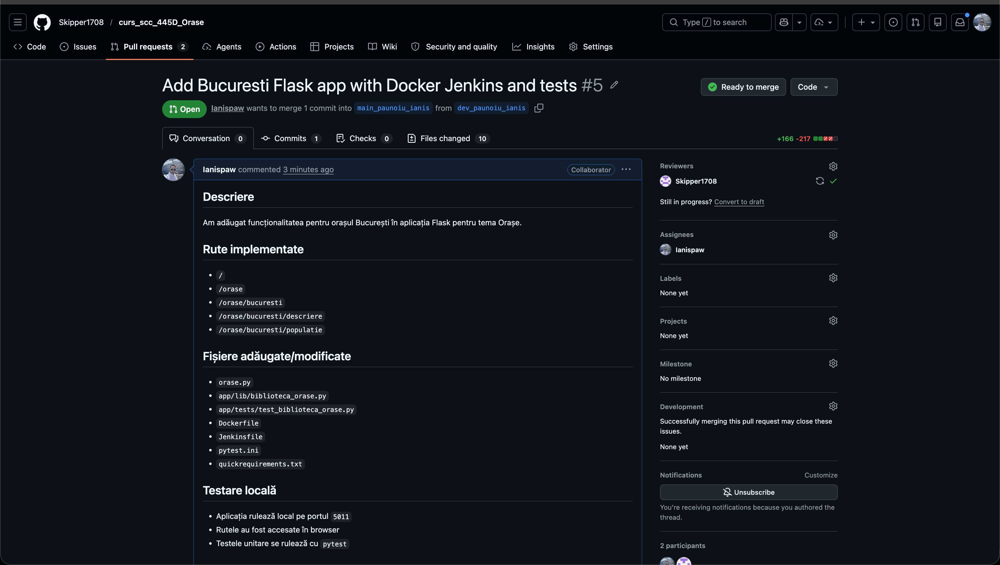
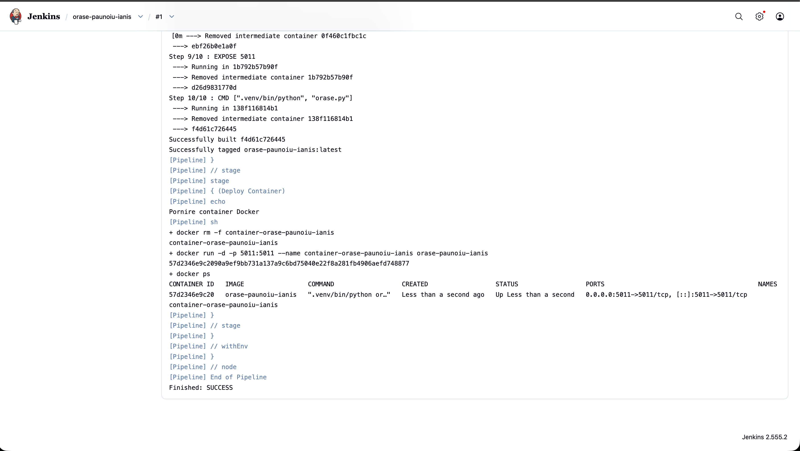
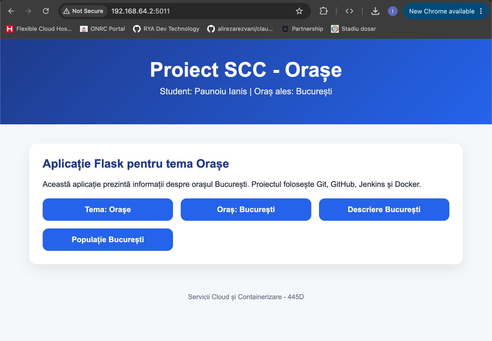
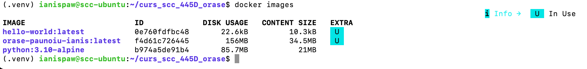
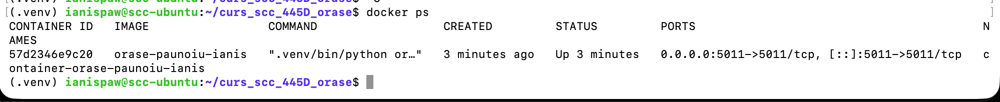

cat > README.md <<'EOF'
# Proiect SCC - Orașe - București

## Cuprins

1. [Date student](#1-date-student)
2. [Descriere proiect](#2-descriere-proiect)
3. [Structura proiectului](#3-structura-proiectului)
4. [Funcționalitate implementată](#4-funcționalitate-implementată)
5. [Rute disponibile](#5-rute-disponibile)
6. [Rulare locală](#6-rulare-locală)
7. [Testare locală](#7-testare-locală)
8. [Containerizare Docker](#8-containerizare-docker)
9. [Pipeline Jenkins](#9-pipeline-jenkins)
10. [Git și GitHub](#10-git-și-github)
11. [Capturi de ecran](#11-capturi-de-ecran)
12. [Stadiul implementării](#12-stadiul-implementării)
13. [Ce mai este de făcut](#13-ce-mai-este-de-făcut)

---

## 1. Date student

- **Nume:** Paunoiu Ianis
- **Grupă:** 445D
- **Disciplina:** Servicii Cloud și Containerizare
- **Temă proiect:** Orașe
- **Element ales:** București
- **Repository:** `curs_scc_445D_Orase`
- **Branch dezvoltare:** `dev_paunoiu_ianis`
- **Branch integrare personală:** `main_paunoiu_ianis`

---

## 2. Descriere proiect

Acest proiect a fost realizat pentru disciplina **Servicii Cloud și Containerizare**.

Scopul proiectului este utilizarea unui flux simplu de dezvoltare software care include:

- utilizarea unei mașini virtuale Linux;
- utilizarea Git și GitHub pentru versionarea codului;
- dezvoltarea unei aplicații web simple cu Flask;
- implementarea unor teste unitare;
- rularea testelor prin Jenkins;
- containerizarea aplicației cu Docker;
- realizarea unui Pull Request și solicitarea unui review de la un coleg.

Aplicația are tema **Orașe**, iar funcționalitatea individuală implementată este pentru orașul **București**.

Proiectul urmărește mai mult partea de lucru colaborativ, DevOps, Git, Jenkins și Docker, nu complexitatea aplicației web.

---

## 3. Structura proiectului

Structura proiectului este următoarea:

    .
    ├── app
    │   ├── __init__.py
    │   ├── lib
    │   │   ├── __init__.py
    │   │   └── biblioteca_orase.py
    │   └── tests
    │       └── test_biblioteca_orase.py
    ├── Dockerfile
    ├── Jenkinsfile
    ├── orase.py
    ├── pytest.ini
    ├── quickrequirements.txt
    └── README.md

Fișierul principal al aplicației este:

    orase.py

Fișierul care conține funcționalitatea pentru orașul ales este:

    app/lib/biblioteca_orase.py

Fișierul care conține testele unitare este:

    app/tests/test_biblioteca_orase.py

---

## 4. Funcționalitate implementată

În fișierul `app/lib/biblioteca_orase.py` au fost implementate două funcții specifice orașului București:

    descriere_bucuresti()
    populatie_bucuresti()

Funcția `descriere_bucuresti()` returnează o descriere scurtă a orașului București.

Funcția `populatie_bucuresti()` returnează o informație generală despre populația orașului București.

Codul aplicației principale importă aceste funcții și le afișează în pagini web separate.

---

## 5. Rute disponibile

Aplicația Flask definește următoarele rute:

| Rută | Descriere |
|---|---|
| `/` | Pagina principală a aplicației |
| `/orase` | Pagina generală pentru tema Orașe |
| `/orase/bucuresti` | Pagina orașului București |
| `/orase/bucuresti/descriere` | Pagina cu descrierea orașului București |
| `/orase/bucuresti/populatie` | Pagina cu informația despre populația orașului București |

Aplicația rulează pe portul:

    5011

Adresa folosită pentru testare în browser:

    http://192.168.64.2:5011

---

## 6. Rulare locală

Pentru rularea locală a aplicației în mașina virtuală Linux, se folosesc următoarele comenzi:

    python3 -m venv .venv
    source .venv/bin/activate
    pip install -r quickrequirements.txt
    python orase.py

După pornire, aplicația afișează în terminal adresele pe care rulează:

    http://127.0.0.1:5011
    http://192.168.64.2:5011

Aplicația a fost testată în browser de pe macOS folosind adresa:

    http://192.168.64.2:5011

Rutele aplicației au fost accesate manual în browser, iar serverul Flask a returnat răspunsuri HTTP `200`.

Exemple de rute testate:

    /
    /orase
    /orase/bucuresti
    /orase/bucuresti/descriere
    /orase/bucuresti/populatie

---

## 7. Testare locală

Testele unitare sunt definite în fișierul:

    app/tests/test_biblioteca_orase.py

Acestea verifică funcțiile:

    descriere_bucuresti()
    populatie_bucuresti()

Pentru rularea testelor se folosește comanda:

    pytest

Configurarea pentru pytest este făcută în fișierul:

    pytest.ini

Conținutul fișierului `pytest.ini`:

    [pytest]
    testpaths = app/tests
    pythonpath = .

Testele verifică dacă funcțiile returnează texte care conțin informațiile așteptate despre București.

---

## 8. Containerizare Docker

Aplicația a fost containerizată folosind Docker.

Fișierul folosit pentru containerizare este:

    Dockerfile

Imaginea Docker a fost construită cu numele:

    orase-paunoiu-ianis

Comanda pentru build:

    docker build -t orase-paunoiu-ianis .

Comanda pentru rularea containerului:

    docker run -p 5011:5011 --name container-orase-paunoiu-ianis orase-paunoiu-ianis

Containerul folosit:

    container-orase-paunoiu-ianis

Pentru verificarea imaginilor Docker:

    docker images

Pentru verificarea containerelor active:

    docker ps

În urma rulării, aplicația a fost accesibilă în browser la:

    http://192.168.64.2:5011

Containerul a expus portul `5011`, astfel încât aplicația Flask să poată fi accesată din browser.

---

## 9. Pipeline Jenkins

Branch-ul de dezvoltare conține fișierul:

    Jenkinsfile

Jenkins a fost instalat și configurat în mașina virtuală Linux.

Job-ul Jenkins creat pentru proiect:

    orase-paunoiu-ianis

Branch-ul folosit de job-ul Jenkins:

    dev_paunoiu_ianis

Pipeline-ul Jenkins conține următoarele etape:

| Etapă | Descriere |
|---|---|
| `Build` | Creează mediul virtual Python și instalează dependențele |
| `Pylint` | Rulează verificări statice de cod cu pylint |
| `Unit Tests` | Rulează testele unitare cu pytest |
| `Docker Build` | Construiește imaginea Docker |
| `Deploy Container` | Pornește containerul Docker |

Rezultatul rulării pipeline-ului Jenkins:

    Finished: SUCCESS

În etapa de deployment, Jenkins pornește containerul Docker folosind imaginea construită.

Comandă folosită în pipeline pentru pornirea containerului:

    docker run -d -p 5011:5011 --name container-orase-paunoiu-ianis orase-paunoiu-ianis

După rularea pipeline-ului, containerul a fost verificat cu:

    docker ps

---

## 10. Git și GitHub

Repository-ul folosit pentru proiect:

    curs_scc_445D_Orase

URL repository:

    https://github.com/Skipper1708/curs_scc_445D_Orase.git

Branch-uri folosite:

    main_paunoiu_ianis
    dev_paunoiu_ianis

Fluxul de lucru folosit:

1. Codul a fost dezvoltat local în mașina virtuală Linux.
2. Codul a fost adăugat pe branch-ul `dev_paunoiu_ianis`.
3. Branch-ul `main_paunoiu_ianis` a fost creat pornind de la `main`.
4. A fost creat un Pull Request din `dev_paunoiu_ianis` către `main_paunoiu_ianis`.
5. A fost adăugat un reviewer pentru Pull Request.
6. Pull Request-ul este pregătit pentru integrare după review.

Pull Request realizat:

    dev_paunoiu_ianis -> main_paunoiu_ianis

Comenzi Git importante folosite:

    git checkout -b dev_paunoiu_ianis
    git add .
    git commit -m "Add Bucuresti Flask app with Docker Jenkins and tests"
    git push -u origin dev_paunoiu_ianis

---

## 11. Capturi de ecran

### 11.1 Pull Request pe GitHub

Pull Request creat din branch-ul `dev_paunoiu_ianis` către branch-ul `main_paunoiu_ianis`, cu reviewer adăugat.

---

### 11.2 Jenkins pipeline - SUCCESS

Pipeline-ul Jenkins a rulat cu succes. În consola Jenkins se poate observa rezultatul final `Finished: SUCCESS`.

---

### 11.3 Aplicația rulând în browser

Aplicația Flask rulează în browser pe adresa `http://192.168.64.2:5011`.

---

### 11.4 Imagine Docker creată

Imaginea Docker `orase-paunoiu-ianis:latest` a fost creată cu succes.

---

### 11.5 Container Docker pornit

Containerul `container-orase-paunoiu-ianis` rulează și expune portul `5011`.

---

## 12. Stadiul implementării

| Componentă | Status |
|---|---|
| Mașină virtuală Linux | Configurat |
| Git | Configurat |
| GitHub repository | Configurat |
| Branch `dev_paunoiu_ianis` | Creat |
| Branch `main_paunoiu_ianis` | Creat |
| Aplicație Flask | Implementat |
| Funcții București | Implementat |
| Rute Flask | Implementat |
| Teste unitare | Implementat |
| Rulare locală | Funcțional |
| Dockerfile | Implementat |
| Docker build | Funcțional |
| Container Docker | Funcțional |
| Jenkinsfile | Implementat |
| Jenkins pipeline | SUCCESS |
| Pull Request | Creat |
| Reviewer | Adăugat |

---

## 13. Ce mai este de făcut

- Așteptarea aprobării Pull Request-ului de către reviewer.
- Integrarea codului din `dev_paunoiu_ianis` în `main_paunoiu_ianis`.
- Integrarea informațiilor necesare în README-ul principal al grupei, dacă este cerută de echipă.
- Prezentarea aplicației rulând local, în Docker și prin Jenkins.

---

## 14. Concluzie

Proiectul demonstrează utilizarea unui flux complet de lucru care include dezvoltare, testare, versionare, code review, automatizare prin Jenkins și containerizare cu Docker.

Funcționalitatea individuală implementată este pentru orașul București, în cadrul temei generale „Orașe”.

Aplicația rulează local, rulează în container Docker, iar pipeline-ul Jenkins s-a executat cu succes.
EOF

## 15. Pași pentru prezentare

Pentru verificare, aplicația poate fi demonstrată astfel:

1. Se deschide mașina virtuală Linux.
2. Se verifică branch-ul `dev_paunoiu_ianis`.
3. Se rulează testele cu `pytest`.
4. Se verifică pipeline-ul Jenkins cu rezultat `Finished: SUCCESS`.
5. Se verifică imaginea Docker cu `docker images`.
6. Se verifică rularea containerului cu `docker ps`.
7. Se accesează aplicația în browser la `http://192.168.64.2:5011`.
