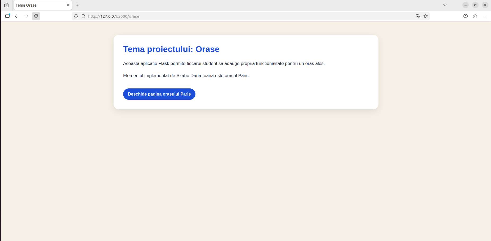
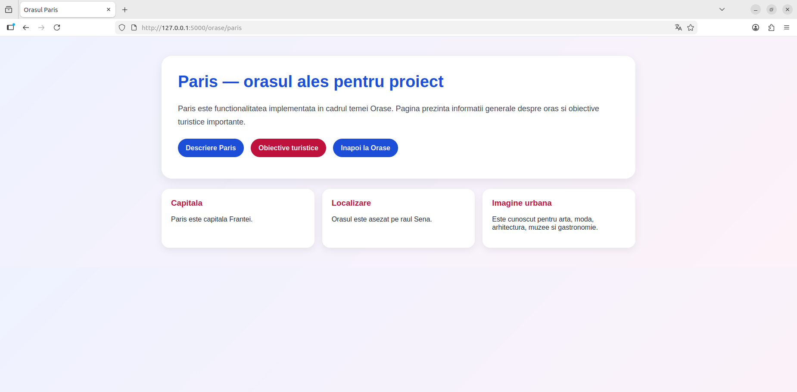
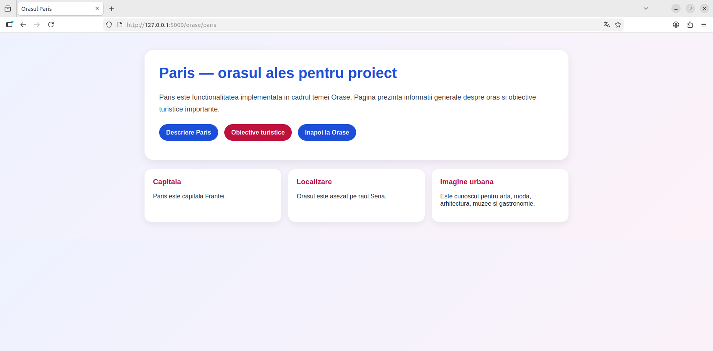
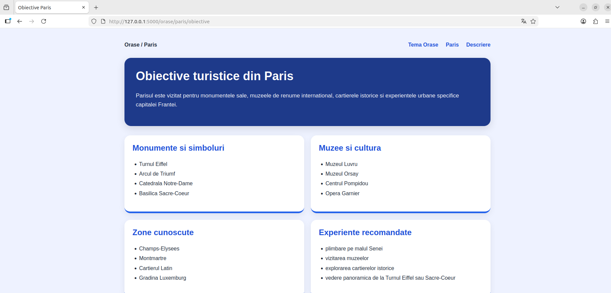
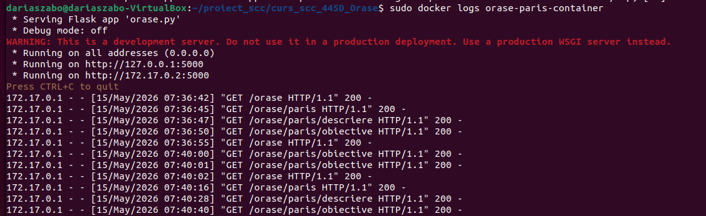

# Orasul Paris — Szabo Daria Ioana

## Cuprins

1. [Obiectivul proiectului](#obiectivul-proiectului)
2. [Date generale](#date-generale)
3. [Cerinte acoperite](#cerinte-acoperite)
4. [Structura proiectului](#structura-proiectului)
5. [Functionalitatea implementata](#functionalitatea-implementata)
6. [Interfata aplicatiei](#interfata-aplicatiei)
7. [Rute implementate](#rute-implementate)
8. [Testare locala](#testare-locala)
9. [Testare cu Jenkins](#testare-cu-jenkins)
10. [Containerizare Docker](#containerizare-docker)
11. [Integrare Git si GitHub](#integrare-git-si-github)
12. [Probleme intampinate si rezolvare](#probleme-intampinate-si-rezolvare)
13. [Pull Request-uri si review](#pull-request-uri-si-review)
14. [Fisierul README.md](#fisierul-readmemd)
15. [Stadiul actual al implementarii](#stadiul-actual-al-implementarii)
16. [Ce mai este de facut](#ce-mai-este-de-facut)

---

## 1. Obiectivul proiectului

Obiectivul proiectului este realizarea unei aplicatii software simple folosind Flask, in care fiecare student adauga propria functionalitate pe tema grupei.

Pentru grupa 445D, tema proiectului este **Orase**, iar elementul ales de mine este **Paris**.

Scopul principal al proiectului nu este dezvoltarea unei aplicatii complexe, ci exersarea unor instrumente folosite frecvent in dezvoltarea software:

- crearea unei aplicatii web simple folosind Flask;
- utilizarea Git si GitHub pentru colaborarea cu colegii;
- lucrul pe branch-uri personale;
- crearea unui Pull Request pentru integrarea modificarilor;
- testarea aplicatiei cu Jenkins;
- containerizarea aplicatiei folosind Docker;
- adaugarea unui Dockerfile in branch-ul personal de dezvoltare;
- documentarea implementarii in fisierul README.md.

---

## 2. Date generale

| Categorie | Informatie |
|----------|------------|
| Dezvoltator | Szabo Daria Ioana |
| Grupa | 445D |
| Tema proiectului | Orase |
| Element implementat | Paris |
| Repository | curs_scc_445D_Orase |
| Branch de dezvoltare | dev_Szabo_Daria |
| Branch principal personal | main_Szabo_Daria |
| Fisier principal aplicatie | orase.py |

---

## 3. Cerinte acoperite

In stadiul actual, proiectul acopera urmatoarele cerinte:

- [x] aplicatie software simpla realizata cu Flask;
- [x] functionalitate proprie pentru orasul Paris;
- [x] doua functii specifice in biblioteca aplicatiei;
- [x] rute Flask pentru tema Orase si pentru elementul Paris;
- [x] teste unitare pentru functiile implementate;
- [x] testare manuala in browser;
- [x] fisier Jenkinsfile configurat;
- [x] testare automata cu Jenkins;
- [x] fisier Dockerfile creat;
- [x] imagine Docker construita;
- [x] container creat pe baza imaginii;
- [x] aplicatia rulata si verificata din container;
- [x] capturi de ecran adaugate in README;
- [x] utilizare Git/GitHub pentru branch-uri, commit si push.

---

## 4. Structura proiectului

Structura folosita pentru implementarea functionalitatii Paris este:

    project/
    ├── app/
    │   ├── lib/
    │   │   ├── __init__.py
    │   │   └── biblioteca_orase.py
    │   ├── routes/
    │   │   ├── __init__.py
    │   │   └── paris.py
    │   └── test/
    │       ├── __init__.py
    │       └── test_biblioteca_orase.py
    ├── screenshots/
    │   ├── docker-images.png
    │   ├── docker-ps.png
    │   ├── docker-logs.png
    │   ├── jenkins-success.png
    │   ├── orase-home.png
    │   ├── paris-home.png
    │   ├── paris-descriere.png
    │   └── paris-obiective.png
    ├── Dockerfile
    ├── Jenkinsfile
    ├── README.md
    ├── requirement.txt
    └── orase.py

Rolul principalelor fisiere:

- `orase.py` porneste aplicatia Flask si inregistreaza rutele pentru Paris;
- `app/lib/biblioteca_orase.py` contine functiile specifice orasului Paris;
- `app/routes/paris.py` contine rutele Flask;
- `app/test/test_biblioteca_orase.py` contine testele unitare;
- `Dockerfile` este folosit pentru containerizarea aplicatiei;
- `Jenkinsfile` defineste pipeline-ul Jenkins;
- `requirement.txt` contine dependentele aplicatiei;
- `screenshots/` contine capturile de ecran folosite pentru documentare.

---

## 5. Functionalitatea implementata

Functionalitatea adaugata este dedicata orasului **Paris**.

Au fost implementate doua functii principale:

- `descriere_paris()`
- `obiective_paris()`

Functia `descriere_paris()` afiseaza o pagina informativa despre orasul Paris. Aceasta include:

- descriere generala;
- informatii despre tara si localizare;
- elemente pentru care orasul este cunoscut;
- rolul orasului in cultura, educatie, economie si turism;
- elemente care fac Parisul special.

Functia `obiective_paris()` afiseaza obiective turistice importante, grupate pe categorii:

- monumente si simboluri;
- muzee si cultura;
- zone cunoscute;
- experiente recomandate.

Functionalitatea poate fi accesata din browser prin rutele dedicate orasului Paris.

---

## 6. Interfata aplicatiei

Aplicatia are o interfata simpla, realizata direct in Flask, folosind HTML si CSS inline.

Interfata a fost structurata ca un mini-dashboard pentru orasul Paris:

- pagina generala pentru tema Orase;
- pagina principala pentru Paris;
- pagina de descriere;
- pagina cu obiective turistice;
- butoane de navigare intre pagini;
- sectiuni vizuale pentru informatii;
- carduri si zone grupate pentru citire mai usoara.

Pagina temei Orase:

Pagina principala Paris:

Descriere Paris:

Obiective Paris:

---

## 7. Rute implementate

Au fost adaugate urmatoarele rute:

| Ruta | Rol |
|------|-----|
| `/` | pagina principala a aplicatiei |
| `/orase` | pagina generala a temei Orase |
| `/orase/paris` | pagina principala pentru orasul Paris |
| `/orase/paris/descriere` | afiseaza descrierea orasului Paris |
| `/orase/paris/obiective` | afiseaza obiective turistice importante din Paris |

Prin aceste rute se respecta cerinta de a avea o ruta pentru tema, o ruta pentru elementul ales si cate o ruta pentru fiecare functie specifica.

---

## 8. Testare locala

Aplicatia a fost testata local prin pornirea serverului Flask si accesarea rutelor in browser.

Au fost verificate urmatoarele aspecte:

- aplicatia porneste fara erori;
- ruta pentru tema Orase este accesibila;
- ruta principala pentru Paris este accesibila;
- ruta pentru descrierea orasului Paris afiseaza informatiile corecte;
- ruta pentru obiectivele turistice afiseaza informatiile corecte;
- navigarea intre pagini functioneaza;
- in terminal apar request-uri HTTP cu status `200`.

Testele unitare au verificat functiile `descriere_paris()` si `obiective_paris()`.

Rezultat local:

    Ran 2 tests in 0.000s

    OK

---

## 9. Testare cu Jenkins

A fost creat un job Jenkins de tip **Pipeline**, numit:

    orase-paris-szabo-daria

Job-ul Jenkins a fost configurat sa preia codul din repository-ul GitHub de pe branch-ul:

    dev_Szabo_Daria

Pipeline-ul foloseste fisierul `Jenkinsfile` si are doua etape:

- `Install dependencies`
- `Run tests`

Rezultatul rularii Jenkins a fost:

    Ran 2 tests in 0.000s

    OK

    Finished: SUCCESS

Aceasta rulare confirma faptul ca testele unitare trec in Jenkins.

Captura Jenkins:

---

## 10. Containerizare Docker

Aplicatia a fost containerizata folosind Docker.

A fost creat fisierul `Dockerfile` in branch-ul personal de dezvoltare. Acesta permite construirea unei imagini Docker care contine aplicatia Flask si dependentele necesare.

Pentru containerizare au fost verificate urmatoarele:

- imaginea Docker a fost creata;
- containerul a fost pornit pe baza imaginii;
- aplicatia ruleaza in container;
- browserul acceseaza aplicatia rulata in container;
- log-urile containerului arata request-urile catre aplicatie.

Imagine Docker creata:

Container creat si pornit:

Browser care acceseaza aplicatia rulata in container:

Mesajele din consola containerului:

---

## 11. Integrare Git si GitHub

Pentru lucrul colaborativ au fost folosite branch-uri personale:

- `main_Szabo_Daria`
- `dev_Szabo_Daria`

Codul a fost implementat pe branch-ul de dezvoltare:

    dev_Szabo_Daria

Modificarile au fost salvate prin commit-uri si trimise pe GitHub prin push.

Integrarea se face prin Pull Request din branch-ul de dezvoltare in branch-ul principal personal:

    dev_Szabo_Daria -> main_Szabo_Daria

Fluxul urmat:

1. clonarea repository-ului;
2. crearea branch-ului principal personal;
3. crearea branch-ului de dezvoltare;
4. implementarea functionalitatii pe branch-ul de dezvoltare;
5. testarea locala;
6. testarea cu Jenkins;
7. containerizarea cu Docker;
8. documentarea in README;
9. crearea Pull Request-ului;
10. review de la un coleg;
11. merge dupa aprobare.

---

## 12. Probleme intampinate si rezolvare

### 1. Autentificare GitHub

Problemă: GitHub nu a acceptat parola normala la `git push`.

Cauza: GitHub foloseste Personal Access Token pentru autentificarea prin terminal.

Rezolvare: a fost generat un Personal Access Token cu permisiunea `repo` si a fost folosit in locul parolei.

---

### 2. Permisiune Docker local

Problemă: comenzile Docker nu au putut fi rulate fara `sudo`.

Cauza: utilizatorul local nu avea permisiune sa acceseze Docker daemon.

Rezolvare: comenzile Docker au fost rulate cu `sudo`.

---

### 3. Jenkins nu recunostea agentul Docker

Problemă: build-ul Jenkins a esuat deoarece Jenkins nu recunostea `agent dockerfile`.

Cauza: lipsea plugin-ul Docker Pipeline.

Rezolvare: a fost instalat plugin-ul Docker Pipeline din Jenkins.

---

### 4. Jenkins nu avea permisiune sa foloseasca Docker

Problemă: Jenkins nu putea accesa Docker daemon.

Cauza: utilizatorul `jenkins` nu era in grupul `docker`.

Rezolvare: utilizatorul `jenkins` a fost adaugat in grupul `docker`, apoi serviciul Jenkins a fost repornit.

---

### 5. Jenkins nu gasea modulul `app.lib`

Problemă: testele rulau local, dar esuau in Jenkins cu eroarea `No module named app.lib`.

Cauza: folderul `app/lib` era ignorat de `.gitignore`, deoarece exista o regula pentru `lib`.

Rezolvare: fisierele din `app/lib` au fost adaugate fortat in Git, apoi s-a facut commit si push.

---

### 6. Docker rula o versiune veche a aplicatiei

Problemă: dupa modificarea interfetei, containerul afisa in continuare varianta veche.

Cauza: imaginea Docker nu fusese reconstruita dupa modificarea codului.

Rezolvare: containerul vechi a fost sters, imaginea Docker a fost reconstruita, apoi containerul a fost pornit din nou.

---

### 7. Transferul capturilor de ecran in masina virtuala

Problemă: Drag and Drop din Windows in Ubuntu nu a functionat in VirtualBox.

Cauza: functia Drag and Drop nu era suportata sau Guest Additions nu erau configurate complet.

Rezolvare: a fost folosit un folder partajat VirtualBox, iar capturile au fost copiate in folderul `screenshots`.

---

## 13. Pull Request-uri si review

Pull Request pentru integrarea functionalitatii Paris:

| Camp | Valoare |
|------|---------|
| Source | dev_Szabo_Daria |
| Destination | main_Szabo_Daria |
| Status | urmeaza sa fie creat / in asteptare review |

Review la Pull Request-ul unui coleg:

| PR | Status |
|----|--------|
| PR #... | urmeaza sa fie completat dupa realizarea review-ului |

Aceasta sectiune va fi actualizata dupa crearea PR-ului propriu si dupa realizarea review-ului la PR-ul unui coleg.

---

## 14. Fisierul README.md

Fisierul `README.md` documenteaza functionalitatea adaugata pentru orasul Paris si stadiul implementarii.

Acesta include:

- obiectivul proiectului;
- date generale despre implementare;
- cerintele acoperite;
- structura proiectului;
- functionalitatea implementata;
- rutele Flask;
- testarea locala;
- testarea cu Jenkins;
- containerizarea Docker;
- capturile de ecran;
- problemele intampinate;
- stadiul curent;
- pasii ramasi pentru finalizarea completa.

---

## 15. Stadiul actual al implementarii

| Componenta | Status |
|-----------|--------|
| Cod functionalitate Paris | Finalizat |
| Functii in `biblioteca_orase.py` | Finalizat |
| Rute Flask | Finalizat |
| Interfata aplicatie | Finalizata |
| Testare manuala | Finalizata |
| Teste unitare | Finalizate |
| Jenkinsfile | Configurat |
| Testare Jenkins | SUCCESS |
| Dockerfile | Creat |
| Imagine Docker | Creata |
| Container Docker | Creat si testat |
| Aplicatie accesibila din container | Verificat |
| README.md | Actualizat |
| Screenshot-uri | Adaugate |
| Pull Request | Urmeaza / in asteptare review |
| Review la coleg | Urmeaza |

---

## 16. Ce mai este de facut

Pentru finalizarea completa a proiectului mai trebuie:

- crearea Pull Request-ului din `dev_Szabo_Daria` in `main_Szabo_Daria`;
- obtinerea unui review de la un coleg;
- realizarea unui review la Pull Request-ul unui coleg;
- actualizarea README-ului cu ID-ul PR-ului propriu;
- actualizarea README-ului cu ID-ul PR-ului la care am facut review;
- integrarea modificarilor dupa aprobare.
