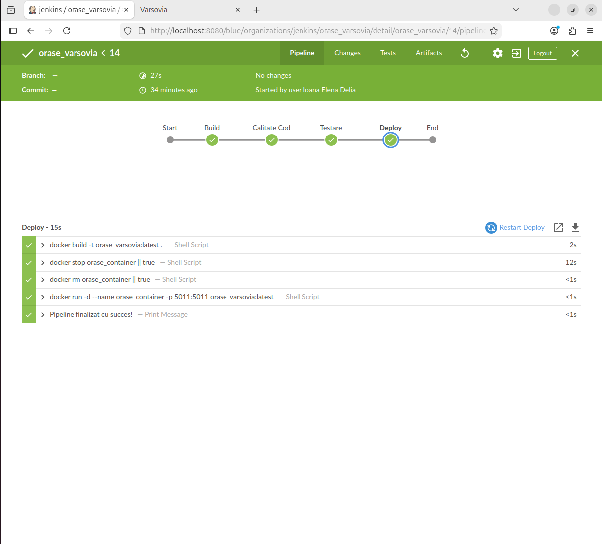
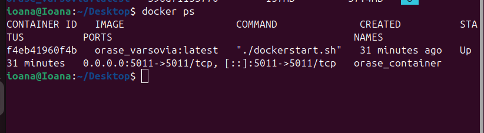
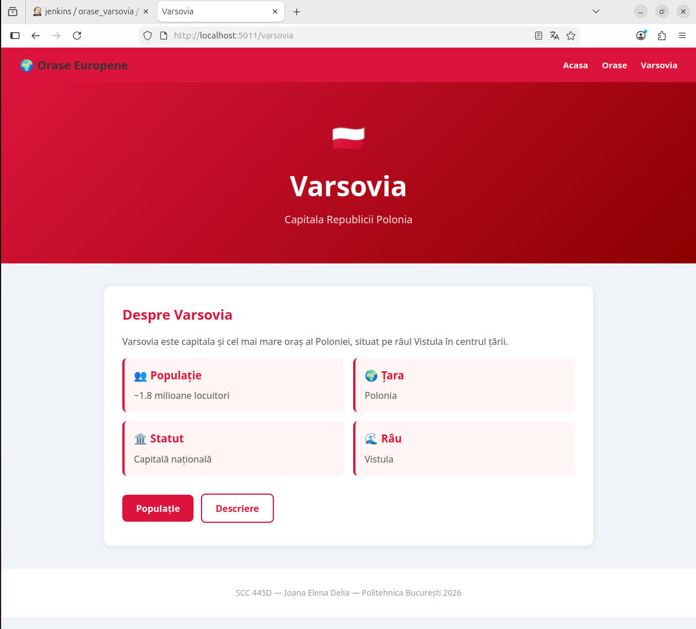

# Proiect SCC - Orașe - Varsovia
## Ioana Elena Delia - grupa 445D

---

## Cuprins

1. [Scopul proiectului](#scopul-proiectului)
2. [Date generale](#date-generale)
3. [Structura proiectului](#structura-proiectului)
4. [Funcționalitatea implementată](#funcționalitatea-implementată)
5. [Descrierea fișierelor](#descrierea-fișierelor)
6. [Funcții implementate](#funcții-implementate)
7. [Rute implementate](#rute-implementate)
8. [Testare](#testare)
9. [Jenkins](#jenkins)
10. [Docker](#docker)
11. [Git și GitHub](#git-și-github)
12. [Pull Request-uri și review](#pull-request-uri-și-review)
13. [Stadiul implementării](#stadiul-implementării)
14. [Ce mai este de făcut](#ce-mai-este-de-făcut)
15. [Capturi de ecran](#capturi-de-ecran)
16. [Concluzie](#concluzie)

---

## Scopul proiectului

Acest proiect a fost realizat în cadrul disciplinei **Servicii Cloud și Containerizare**.

Scopul proiectului este folosirea practică a unor unelte întâlnite în dezvoltarea software și DevOps:

- Git și GitHub
- Jenkins
- Docker
- Flask
- pytest
- pylint
- mașină virtuală Ubuntu

Tema grupei 445D este **Orașe**, iar elementul implementat de mine este orașul **Varsovia**.

---

## Date generale

- **Student:** Ioana Elena Delia
- **Grupă:** 445D
- **Temă:** Orașe
- **Oraș ales:** Varsovia
- **Repository:** `curs_scc_445D_Orase`
- **Branch de dezvoltare:** `dev_Ioana_Delia`
- **Branch principal personal:** `main_Ioana_Delia`
- **Fișier principal aplicație:** `orase.py`
- **Bibliotecă:** `app/lib/biblioteca_orase.py`
- **Port container Docker:** `5011`

---

## Structura proiectului

```text
.
├── app
│   ├── __init__.py
│   ├── lib
│   │   ├── __init__.py
│   │   └── biblioteca_orase.py
│   └── tests
│       ├── __init__.py
│       └── test_lib_orase.py
├── docs
│   └── imagini
│       ├── browser_varsovia.png
│       ├── docker_images.png
│       ├── docker_logs.png
│       ├── docker_ps.png
│       ├── jenkins_build_success.png
│       └── jenkins_console_output.png
├── activeaza_venv
├── activeaza_venv_jenkins
├── dockerstart.sh
├── Dockerfile
├── Jenkinsfile
├── orase.py
├── pytest.ini
├── quickrequirements.txt
├── README.md
├── LICENSE
└── .gitignore
```

---

## Funcționalitatea implementată

Am implementat o aplicație web Flask pentru tema **Orașe**, având ca element ales orașul **Varsovia**.

Aplicația oferă:

- o pagină principală;
- o pagină pentru lista orașelor disponibile;
- o pagină dedicată orașului Varsovia;
- o pagină pentru populația orașului Varsovia;
- o pagină pentru descrierea orașului Varsovia.

Interfața este realizată direct în Flask, folosind HTML și CSS incluse în paginile returnate de aplicație.

---

## Descrierea fișierelor

### `orase.py`

Este fișierul principal al aplicației Flask.

Conține:

- inițializarea aplicației Flask;
- stilizarea paginilor HTML cu CSS inline;
- rutele aplicației.

### `app/lib/biblioteca_orase.py`

Conține cele două funcții specifice orașului Varsovia:

- `populatie_varsovia()`
- `descriere_varsovia()`

Aceste funcții returnează texte care sunt afișate în paginile aplicației.

### `app/tests/test_lib_orase.py`

Conține testele automate pentru funcțiile din bibliotecă.

### `pytest.ini`

Configurează rularea testelor cu `pytest`.

### `quickrequirements.txt`

Conține dependențele necesare proiectului:

```text
flask
pytest
pylint
gunicorn
```

### `Dockerfile`

Definește imaginea Docker a aplicației.

Imaginea folosită este:

```dockerfile
FROM python:3.10-alpine
```

### `dockerstart.sh`

Script folosit pentru pornirea aplicației Flask în container pe portul `5011`.

### `activeaza_venv`

Script pentru crearea și activarea mediului virtual local.

### `activeaza_venv_jenkins`

Script folosit în Jenkins pentru crearea mediului virtual și instalarea dependențelor.

### `Jenkinsfile`

Definește pipeline-ul Jenkins pentru build, verificarea calității codului, testare și deploy în container Docker.

---

## Funcții implementate

În fișierul `app/lib/biblioteca_orase.py` au fost implementate funcțiile:

```python
populatie_varsovia()
descriere_varsovia()
```

### `populatie_varsovia()`

Returnează informații despre populația orașului Varsovia, capitala Poloniei, cu aproximativ 1.8 milioane de locuitori.

### `descriere_varsovia()`

Returnează o descriere a orașului Varsovia, menționând faptul că este capitala Poloniei, situată pe râul Vistula, cunoscută pentru Orașul Vechi reconstruit după cel de-al Doilea Război Mondial și pentru Palatul Culturii și Științei.

---

## Rute implementate

Aplicația conține următoarele rute:

```text
/
```

Pagina principală a aplicației.

```text
/orase
```

Pagina cu lista orașelor disponibile.

```text
/varsovia
```

Pagina dedicată orașului Varsovia.

```text
/varsovia/populatie
```

Pagina care afișează informațiile despre populația orașului Varsovia.

```text
/varsovia/descriere
```

Pagina care afișează descrierea orașului Varsovia.

---

## Testare

### Activarea mediului virtual

```bash
. ./activeaza_venv
```

### Rularea testelor

```bash
pytest app/tests/ -v
```

Rezultat obținut:

```text
2 passed
```

Testele verifică:

- funcția `populatie_varsovia()`;
- funcția `descriere_varsovia()`.

---

## Jenkins

Proiectul conține un fișier `Jenkinsfile`.

Pipeline-ul Jenkins are următoarele etape:

1. **Build**
   - creează mediul virtual Python;
   - instalează dependențele din `quickrequirements.txt`.

2. **Calitate Cod**
   - rulează `pylint` pe fișierele din aplicație și teste;
   - este folosit `--exit-zero`, astfel încât pipeline-ul să continue și să afișeze rezultatele.

3. **Testare**
   - rulează testele automate cu `pytest`.

4. **Deploy**
   - construiește imaginea Docker;
   - oprește containerul vechi, dacă există;
   - șterge containerul vechi, dacă există;
   - pornește containerul nou pe portul `5011`.

Rezultate obținute:

- pipeline Jenkins finalizat cu succes;
- testele automate au trecut;
- aplicația a fost pregătită pentru rulare în container.

### Capturi Jenkins

#### Build reușit în Jenkins



---

## Docker

Containerizarea aplicației a fost realizată folosind `Dockerfile`.

Imaginea Docker este construită cu:

```bash
docker build -t orase_varsovia:latest .
```

Containerul este pornit cu:

```bash
docker stop orase_container || true
docker rm orase_container || true
docker run -d --name orase_container -p 5011:5011 orase_varsovia:latest
```

Verificarea containerului:

```bash
docker ps
```

Verificarea logurilor:

```bash
docker logs orase_container
```

Aplicația din container a fost accesată în browser la:

```text
http://localhost:5011/
http://localhost:5011/orase
http://localhost:5011/varsovia
http://localhost:5011/varsovia/populatie
http://localhost:5011/varsovia/descriere
```

---

## Git și GitHub

Am lucrat pe branch-ul personal:

```text
dev_Ioana_Delia
```

Modificările au fost salvate prin commit și trimise pe GitHub prin push.

A fost realizat Pull Request către branch-ul personal principal:

```text
dev_Ioana_Delia -> main_Ioana_Delia
```

---

## Pull Request-uri și review

### Pull Request realizat

A fost realizat Pull Request din:

```text
dev_Ioana_Delia
```

către:

```text
main_Ioana_Delia
```

Pull Request-ul a fost aprobat și integrat în branch-ul principal personal.

### Review primit

Am primit review de la un coleg din grupă, conform cerințelor proiectului.

### Review oferit

Am participat la procesul de code review în cadrul proiectului de grupă.

---

## Stadiul implementării

### Realizat

- [x] alegerea orașului Varsovia;
- [x] implementarea aplicației Flask;
- [x] implementarea fișierului `orase.py`;
- [x] implementarea bibliotecii `app/lib/biblioteca_orase.py`;
- [x] implementarea funcțiilor `populatie_varsovia()` și `descriere_varsovia()`;
- [x] implementarea rutelor Flask;
- [x] implementarea testelor automate;
- [x] rularea testelor cu `pytest`;
- [x] crearea fișierului `pytest.ini`;
- [x] crearea fișierului `quickrequirements.txt`;
- [x] crearea fișierului `Dockerfile`;
- [x] crearea scriptului `dockerstart.sh`;
- [x] crearea scriptului `activeaza_venv`;
- [x] crearea scriptului `activeaza_venv_jenkins`;
- [x] crearea fișierului `Jenkinsfile`;
- [x] rularea pipeline-ului Jenkins;
- [x] build Jenkins cu succes;
- [x] teste trecute în Jenkins;
- [x] build imagine Docker;
- [x] pornire container Docker;
- [x] accesare aplicație din container;
- [x] verificare loguri Docker;
- [x] capturi de ecran pentru Jenkins;
- [x] capturi de ecran pentru Docker;
- [x] commit și push pe GitHub;
- [x] Pull Request către `main_Ioana_Delia`;
- [x] review primit de la coleg.

---

## Ce mai este de făcut

- verificarea finală înainte de prezentare;
- demonstrarea testelor, Jenkins și Docker în cadrul susținerii.

---

## Capturi de ecran

### Imaginea Docker creată


### Containerul creat pe baza imaginii



### Browserul care accesează aplicația rulată în container



### Mesajele afișate în consola containerului


### Jenkins build success


---

## Concluzie

Proiectul implementează funcționalitatea pentru orașul **Varsovia** în cadrul temei **Orașe**.

Aplicația este funcțională, testele trec, pipeline-ul Jenkins a fost configurat, iar aplicația a fost containerizată cu Docker și accesată din browser.

Proiectul este pregătit pentru prezentare.
