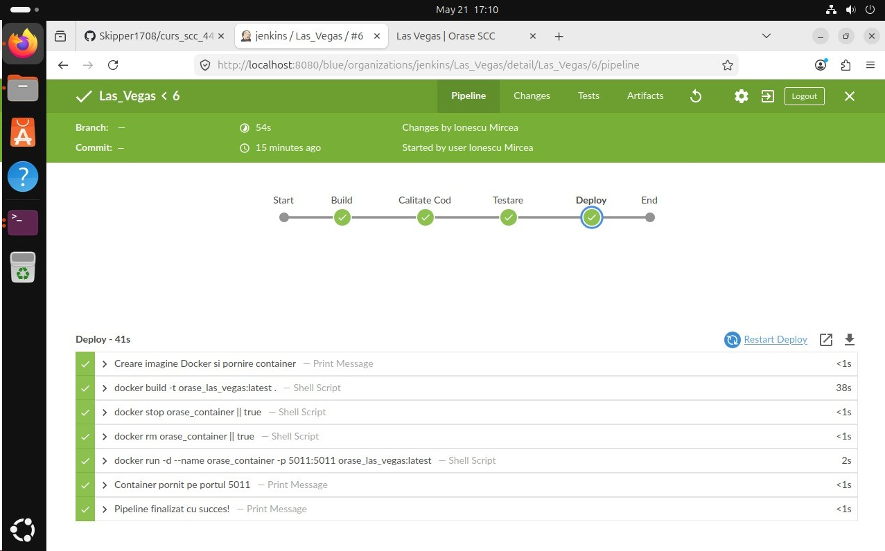
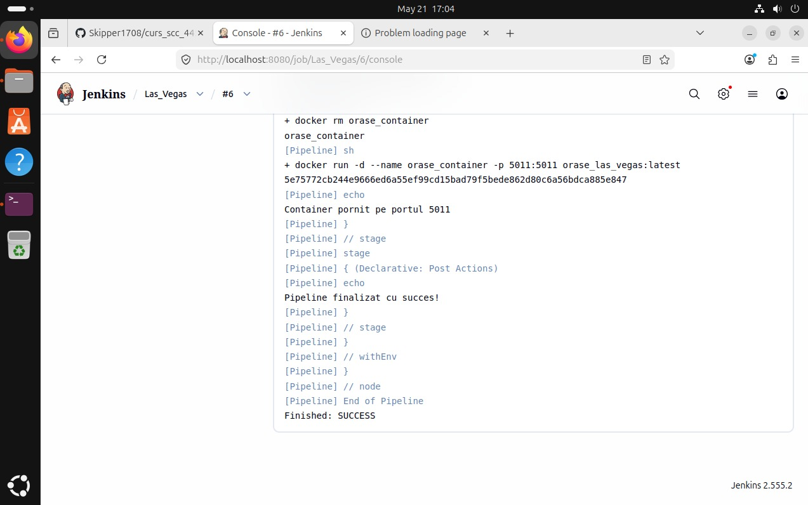
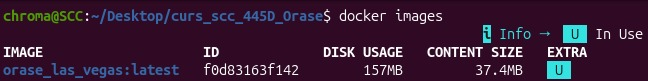
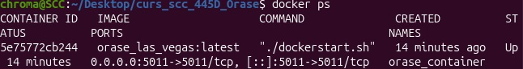
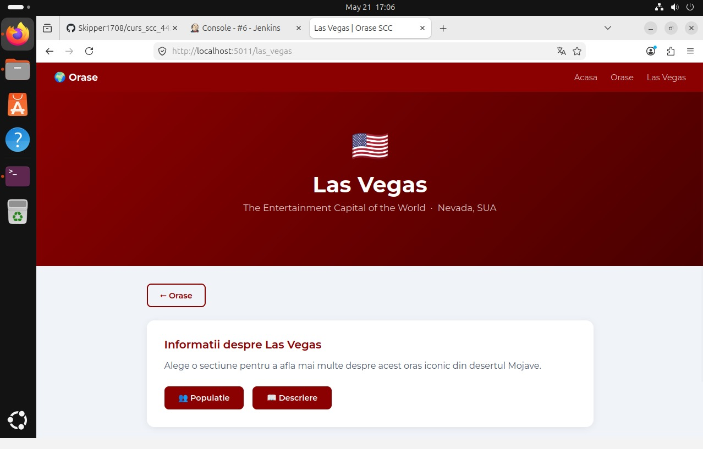

# Las Vegas — Ionescu Mircea | SCC 445D

## 1. Functionalitatea adaugata

Aplicatie web Flask care prezinta informatii despre **Las Vegas**.

**Rute implementate:**
| Ruta | Descriere |
|------|-----------|
| `/` | Pagina principala |
| `/orase` | Lista oraselor disponibile |
| `/las_vegas` | Pagina dedicata Las Vegas |
| `/las_vegas/populatie` | Populatia orasului |
| `/las_vegas/descriere` | Descrierea orasului |

**Functii in `app/lib/biblioteca_orase.py`:**
- `populatie_las_vegas()` — returneaza populatia ca string
- `descriere_las_vegas()` — returneaza descrierea ca string

---

## 2. Stadiul implementarii

- [x] Functii `populatie_las_vegas` si `descriere_las_vegas`
- [x] Aplicatie Flask cu 4 rute obligatorii
- [x] Teste pytest (`test_populatie_las_vegas`, `test_descriere_las_vegas`)
- [x] Dockerfile
- [x] Jenkinsfile cu 4 stage-uri
- [x] Scripts: `dockerstart.sh`, `activeaza_venv`, `activeaza_venv_jenkins`
- [x] `pytest.ini` si `quickrequirements.txt`
- [x] Jenkins pipeline PASS
- [x] Docker build + run functional
- [x] Aplicatie accesibila din browser

---

## 3. Testare

### Rulare locala Flask
```bash
pip install flask
export FLASK_APP=orase
flask run --host=0.0.0.0 --port=5011
```
Acceseaza: `http://localhost:5011`

### Rulare teste pytest
```bash
pip install pytest
pytest app/tests/ -v
```

### Rulare cu Jenkins

1. Pe VM, configureaza Jenkins sa pointeze pe branch-ul `dev_Ionescu_Mircea`
2. Ruleaza pipeline-ul manual
3. Verifica toate cele 4 stage-uri: Build, Calitate Cod, Testare, Deploy

**Screenshot Jenkins PASS — Blue Ocean:**



**Screenshot Jenkins Console — Finished: SUCCESS:**



---

## 4. Integrare Git

**Structura branch-uri:**
- `dev_Ionescu_Mircea` — dezvoltare (acest branch)
- `main_Ionescu_Mircea` — productie (merge prin PR cu review)

**Workflow:**
```
local: git checkout dev_Ionescu_Mircea
       [modifici fisierele]
       git add <fisier>
       git commit -m "mesaj"
       git push
VM:    git pull
       [rulezi Jenkins]
```

**Pull Requests:**
| PR | De la | Catre | Status |
|----|-------|-------|--------|
| - | dev_Ionescu_Mircea | main_Ionescu_Mircea | de creat |
| - | dev_Ionescu_Mircea | main | README only, de creat |

---

## 5. Containerizare Docker

```bash
docker build -t orase_las_vegas:latest .
docker stop orase_container || true
docker rm orase_container || true
docker run -d --name orase_container -p 5011:5011 orase_las_vegas:latest
```

Acceseaza din browser: `http://localhost:5011`

**docker images — imaginea creata:**



**docker ps — containerul pornit:**



**Browser — aplicatie accesata din container:**



**docker logs orase_container — loguri:**


---

## 6. PR-uri la care am facut review

| PR | Autor | Status |
|----|-------|--------|
| - | - | de completat |

---

## 7. Ce mai este de facut

- [ ] Screenshot `docker logs orase_container` si adaugat in README
- [ ] Creat PR `dev_Ionescu_Mircea` → `main_Ionescu_Mircea` cu reviewer
- [ ] Creat PR cu README catre `main` al grupei
- [ ] Facut review la PR-ul unui coleg
